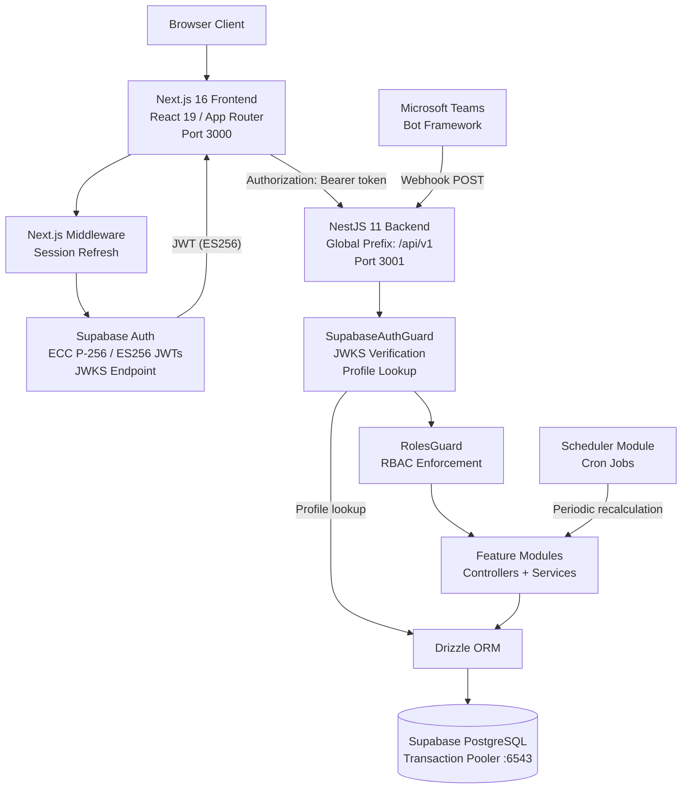

# Architecture

## System Overview

The system is a full-stack TypeScript application with three layers: a Next.js 16 frontend (App Router), a NestJS 11 backend REST API, and Supabase providing PostgreSQL and authentication.



---

## Backend Module Map

```
AppModule
├── ConfigModule (global)
├── ScheduleModule (cron)
├── DatabaseModule (Drizzle provider)
├── UsersModule
├── ChargeCodesModule
├── TimesheetsModule
├── BudgetsModule
├── ApprovalsModule
├── CalendarModule
├── CostRatesModule
├── SchedulersModule
│   ├── TimesheetsScheduler
│   ├── BudgetsScheduler
│   ├── ReportsScheduler
│   └── NotificationService
├── ReportsModule
└── IntegrationsModule
    ├── Teams bot (Bot Framework)
    ├── NotificationService
    └── CSV upload (projects)
```

---

## Frontend Page Tree

All pages under `(authenticated)/` require a valid Supabase session. The Next.js middleware refreshes the session on every request and redirects unauthenticated users to `/login`.

```
app/
├── login/                        # Public — Supabase email/password login
├── auth/callback/                # Public — OAuth callback handler
└── (authenticated)/              # Protected layout group
    ├── page.tsx                  # Dashboard: summary, pending items, alerts
    ├── time-entry/
    │   └── page.tsx              # Timesheet entry: period selector, daily grid
    ├── charge-codes/
    │   └── page.tsx              # Charge code browser: hierarchical tree
    ├── approvals/
    │   └── page.tsx              # Approval queue: pending + history tabs
    ├── budget/
    │   └── page.tsx              # Budget tracking: alerts, summaries, drill-down
    ├── reports/
    │   └── page.tsx              # Analytics: utilization, chargeability, financials
    ├── profile/
    │   └── page.tsx              # User profile: edit name, department
    ├── settings/
    │   └── page.tsx              # App settings
    └── admin/
        ├── users/
        │   └── page.tsx          # User management: roles, job grades
        ├── calendar/
        │   └── page.tsx          # Calendar admin: holidays, vacations
        └── rates/
            └── page.tsx          # Cost rate management: job grade → hourly rate
```

---

## Authentication Flow

1. User submits email and password on `/login`.
2. Next.js calls Supabase Auth, which returns an ES256-signed JWT access token.
3. Next.js middleware runs on every request to the `(authenticated)` group, refreshing the session token silently.
4. Frontend API calls attach the JWT as `Authorization: Bearer <token>`.
5. `SupabaseAuthGuard` on the backend:
   - Fetches the JWKS public keys from `https://lchxtkiceeyqjksganwr.supabase.co/auth/v1/.well-known/jwks.json`.
   - Verifies the token signature using the ES256 algorithm.
   - Loads the corresponding `profiles` row from the database using the JWT `sub` claim (user UUID).
   - Attaches the profile to `request.user`.
6. `RolesGuard` checks the `@Roles()` decorator on the handler. Roles not listed will receive `403 Forbidden`.
7. Controllers access the authenticated profile via `@CurrentUser()`.

Endpoints decorated with `@Public()` bypass both guards entirely.

---

## Role-Based Access Control

| Role | Description |
|------|-------------|
| `employee` | Can create/submit own timesheets; view assigned charge codes |
| `charge_manager` | Approves timesheets at the CC-owner stage; manages charge code access |
| `pmo` | Project management office; read access to reports and notifications |
| `finance` | Read access to cost rates and financial reports |
| `admin` | Full access to all endpoints including user management and admin CRUD |

---

## Timesheet State Machine

Timesheets follow a two-stage approval workflow before being locked.

```
draft ──submit──▶ submitted ──manager approve──▶ manager_approved ──cc approve──▶ cc_approved ──cron──▶ locked
  ▲                   │                                  │
  │                reject                             reject
  └───────────────────┴──────────────────────────────────┘
                       ▼
                   rejected (employee can revise and resubmit)
```

---

## Charge Code Hierarchy

Charge codes use a **materialized path** pattern:

```
PROG-001 (program)
└── PROJ-001 (project)
    ├── ACT-001 (activity)
    │   └── TASK-001 (task)
    └── ACT-002 (activity)
```

Each row stores:
- `id` — the charge code identifier (e.g., `ACT-001`)
- `path` — full path string (e.g., `PROG-001/PROJ-001/ACT-001`)
- `level` — enum: `program | project | activity | task`
- `parent_id` — foreign key to the parent charge code

This allows efficient tree queries without recursive CTEs.

---

## Database Overview

Ten tables managed by Drizzle ORM:

| Table | Purpose |
|-------|---------|
| `profiles` | User accounts, roles, job grades |
| `charge_codes` | Hierarchical project/activity codes |
| `charge_code_access` | User-to-charge-code assignments |
| `timesheets` | Per-user, per-period timesheet records |
| `timesheet_entries` | Daily hour entries within a timesheet |
| `approval_logs` | Audit log of all approval actions |
| `budgets` | Budget tracking per charge code |
| `calendar_days` | Working days, weekends, and holidays |
| `vacation_requests` | Employee vacation requests |
| `cost_rates` | Hourly cost rates by job grade |

See [database-schema.md](database-schema.md) for the full ERD and column definitions.

---

## API Prefix Convention

All backend endpoints are served under the global prefix `/api/v1`. Controllers must not include this prefix in their `@Controller()` decorator — the global prefix is registered once in `main.ts` via `app.setGlobalPrefix('api/v1')`.

Correct:
```typescript
@Controller('timesheets')       // resolves to /api/v1/timesheets
```

Incorrect:
```typescript
@Controller('api/v1/timesheets') // resolves to /api/v1/api/v1/timesheets
```

See [troubleshooting.md](troubleshooting.md#issue-double-route-prefix-in-controllers) for details on this bug.

---

## Key Patterns

### Server-Side Rendering with Bearer Auth

Next.js server components and `fetch()` calls include the Supabase session token in the `Authorization` header. The `api.ts` utility retrieves the current session from Supabase client and injects the token automatically.

### Scheduled Jobs

Three cron jobs run on the backend:

- `TimesheetsScheduler` — locks approved timesheets after the cutoff date
- `BudgetsScheduler` — recalculates `actual_spent` and `forecast_at_completion` from approved entries
- `ReportsScheduler` — pre-aggregates report data for fast queries

### Cost Calculation

`calculated_cost` per entry = `hours × hourly_rate` where the hourly rate is looked up from `cost_rates` by the user's `job_grade`. This is computed at entry save time and stored on `timesheet_entries.calculated_cost`.
