# คู่มือการใช้งานระบบ Timesheet

> **เวอร์ชัน**: 4.0 ภาษาไทย
> **อัปเดตล่าสุด**: 31 มีนาคม 2026
> **ระบบ**: RIS Timesheet & Cost Allocation System

---

## สารบัญ

1. [ภาพรวมระบบ](#1-ภาพรวมระบบ)
2. [การเข้าใช้งาน](#2-การเข้าใช้งาน)
3. [หน้าหลัก (Dashboard)](#3-หน้าหลัก-dashboard)
4. [การกรอกเวลา (Time Entry)](#4-การกรอกเวลา-time-entry)
5. [ฟีเจอร์ AI (AI-Powered Features)](#5-ฟีเจอร์-ai-ai-powered-features)
6. [การอนุมัติ (Approval Workflow)](#6-การอนุมัติ-approval-workflow)
7. [รหัสงาน (Charge Codes)](#7-รหัสงาน-charge-codes)
8. [ปฏิทินและวันลา](#8-ปฏิทินและวันลา)
9. [รายงาน (Reports & Analytics)](#9-รายงาน-reports--analytics)
10. [งบประมาณ (Budget)](#10-งบประมาณ-budget)
11. [การตั้งค่า (Settings)](#11-การตั้งค่า-settings)
12. [จัดการระบบ (Admin)](#12-จัดการระบบ-admin)
13. [สิทธิ์การใช้งานตามบทบาท](#13-สิทธิ์การใช้งานตามบทบาท)
14. [สรุปขั้นตอนประจำสัปดาห์](#14-สรุปขั้นตอนประจำสัปดาห์)

---

## ใครควรอ่านส่วนไหน (Who Should Read What)

คู่มือนี้ครอบคลุมทุกตำแหน่ง — ใช้ตารางด้านล่างเพื่อข้ามไปยังส่วนที่เกี่ยวข้องกับคุณ:

| ตำแหน่ง | สัญลักษณ์ | ส่วนที่ควรอ่าน |
| --- | --- | --- |
| **พนักงานทั่วไป** (Employee) | 👤 | บทที่ 1–4 ภาพรวม, เข้าสู่ระบบ, Dashboard, กรอกเวลา+ส่งอนุมัติ+OT · บทที่ 5 ฟีเจอร์ AI · 8 ปฏิทิน · 11 ตั้งค่า · 14 สรุปขั้นตอน |
| **หัวหน้างาน / Manager** (Charge Manager) | 👔 | ทุกส่วนของพนักงาน + บทที่ 6 อนุมัติ Timesheet · 7 รหัสงาน |
| **ผู้ดูแลระบบ** (Admin) | ⚙️ | ทุกส่วน รวมถึง บทที่ 9 รายงาน · 10 งบประมาณ · 12 จัดการระบบ · 13 สิทธิ์ตามบทบาท |
| **PMO / Finance** (ฝ่ายวางแผน / การเงิน) | 📊 | ทุกส่วนของพนักงาน + บทที่ 7 รหัสงาน · 9 รายงาน · 10 งบประมาณ |

> **💡 เคล็ดลับ:** หัวข้อที่มีสัญลักษณ์ตำแหน่ง (เช่น 👤 👔 ⚙️ 📊) หมายความว่าส่วนนั้นเกี่ยวข้องกับตำแหน่งนั้นเป็นหลัก

---

## 1. ภาพรวมระบบ 👤👔⚙️📊

ระบบ Timesheet เป็นเครื่องมือบันทึกเวลาทำงานและจัดสรรต้นทุนขององค์กร ใช้งานผ่านเว็บเบราว์เซอร์ได้ทุกอุปกรณ์

**ระบบนี้ทำอะไรได้:**

| ความสามารถ | รายละเอียด |
| --- | --- |
| **บันทึกเวลา** | กรอกชั่วโมงทำงานรายสัปดาห์ แยกตามรหัสงาน (Charge Code) |
| **ส่ง-อนุมัติ** | ส่งใบบันทึกเวลาให้หัวหน้าตรวจสอบและอนุมัติ |
| **ปฏิทินและวันลา** | ดูวันหยุด วันลา และขอลาพักร้อน |
| **ติดตามงบประมาณ** | เปรียบเทียบงบที่ตั้งไว้กับค่าใช้จ่ายจริง |
| **รายงาน** | วิเคราะห์ต้นทุน อัตรา chargeability แยกตามโปรแกรม/หน่วยงาน/บุคคล |
| **การแจ้งเตือน** | แจ้งเตือนกำหนดส่ง สถานะอนุมัติ และงบประมาณ |

**เมนูหลักทางซ้ายมือ (Sidebar):**

| ไอคอน | หน้า | ผู้ที่เห็น |
| --- | --- | --- |
| 🏠 Dashboard | หน้าหลัก | ทุกคน |
| 🕐 Time Entry | บันทึกเวลา | ทุกคน |
| 📅 Calendar | ปฏิทินและวันลา | ทุกคน |
| 🏷️ Charge Codes | รหัสงาน | หัวหน้า, ผู้ดูแล |
| ✅ Approvals | อนุมัติ | หัวหน้า, ผู้ดูแล |
| 📊 Reports | รายงาน | ผู้บริหาร, การเงิน |
| 💰 Budget | งบประมาณ | ผู้บริหาร, การเงิน |
| 👥 Admin (Users) | จัดการผู้ใช้ | ผู้ดูแลระบบ |
| 📅 Admin (Calendar) | จัดการปฏิทิน | ผู้ดูแลระบบ |
| ⚙️ Settings | ตั้งค่า | ทุกคน |

---

## 2. การเข้าใช้งาน 👤👔⚙️📊

### 2.1 เข้าสู่ระบบ (Login)

**ขั้นตอน:**

1. เปิดเว็บไซต์ระบบ Timesheet ขององค์กร
2. กรอก **อีเมล** ในช่องแรก (ตัวอย่าง: you@central.co.th)
3. กรอก **รหัสผ่าน** ในช่องที่สอง
   - กดปุ่ม **"Show"** ด้านขวาของช่องรหัสผ่าน เพื่อแสดงรหัสผ่านที่พิมพ์
4. กดปุ่มสีเขียว **"Sign In"**

**วิธีเข้าสู่ระบบอื่น:**

- กดปุ่ม **"Sign in with Microsoft"** (ปุ่มสีขาวมีโลโก้ Microsoft) เพื่อเข้าด้วยบัญชี Microsoft ขององค์กร
- ถ้าลืมรหัสผ่าน กดลิงก์ **"Forgot password?"** ด้านล่าง → ระบบจะส่งอีเมลให้ตั้งรหัสผ่านใหม่

### 2.2 ส่วนต่าง ๆ ของหน้าจอ

เมื่อเข้าสู่ระบบแล้ว จะเห็น:

- **แถบเมนูด้านซ้าย (Sidebar)** — ไอคอนสำหรับเปิดหน้าต่าง ๆ โดยมีโลโก้ **RIS** อยู่ด้านบนสุด (บางเมนูจะมองเห็นเฉพาะบางตำแหน่ง)
- **แถบด้านบน** — ปุ่มแฮมเบอร์เกอร์ (☰) + ชื่อหน้าที่เปิดอยู่
- **ปุ่มกระดิ่ง** — แจ้งเตือน (มุมขวาบน)
- **รูปโปรไฟล์** — มุมขวาบน กดเพื่อดูเมนูโปรไฟล์/ออกจากระบบ

### 2.3 ออกจากระบบ

กดที่ **รูปโปรไฟล์ (ตัวอักษรย่อ)** ที่มุมขวาบน → เลือก **"Log out"**

---

## 3. หน้าหลัก (Dashboard) 👤👔⚙️📊

> ทุกคนเห็นหน้านี้

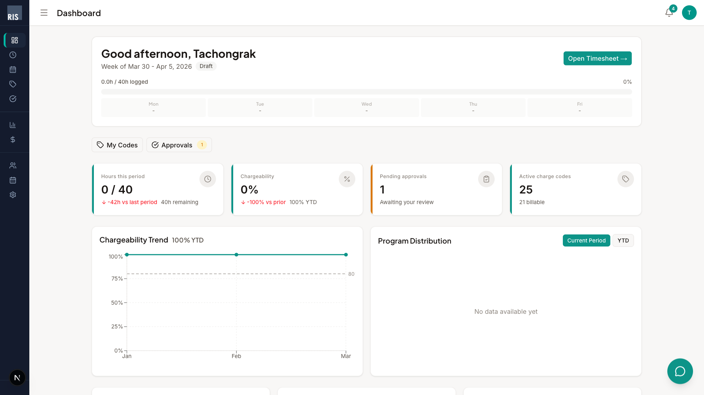

หน้าหลักแสดงภาพรวมการทำงานของคุณในสัปดาห์ปัจจุบัน:

### 3.1 ส่วนต้อนรับ (ด้านบน)

| สิ่งที่แสดง | ตัวอย่าง |
| --- | --- |
| **คำทักทาย + ชื่อ** | "Good evening, Tachongrak" |
| **ช่วงสัปดาห์** | "Week of Mar 30 - Apr 5, 2026" |
| **สถานะใบบันทึกเวลา** | ป้ายสี เช่น `Draft`, `Submitted`, `Approved`, `Rejected` |

### 3.2 แถบความคืบหน้า (Progress Bar)

- แสดง **ชั่วโมงที่บันทึกแล้ว / เป้าหมาย** เช่น "0.0h / 40h logged"
- ด้านล่างมีแถบแยกรายวัน **จ.–พฤ.** (และต่อไป) แสดงชั่วโมงแต่ละวัน

### 3.3 ปุ่มลัด (Quick Buttons)

| ปุ่ม | ทำอะไร |
| --- | --- |
| **My Codes** | ดูรหัสงานที่มอบหมายให้คุณ |
| **Approvals** (มีตัวเลขสีส้ม) | ดูใบบันทึกเวลาที่รอคุณอนุมัติ (สำหรับหัวหน้า) |

### 3.4 กล่องตัวเลข KPI (4 กล่อง)

| กล่อง | ความหมาย | ตัวอย่าง |
| --- | --- | --- |
| **Hours this period** | ชั่วโมงที่บันทึกในสัปดาห์นี้ / เป้าหมาย | 0 / 40 |
| **Chargeability** | อัตราการ charge งาน (เปอร์เซ็นต์) | 0% |
| **Pending approvals** | จำนวนใบที่รอคุณอนุมัติ | 1 |
| **Active charge codes** | จำนวนรหัสงานที่ใช้งานอยู่ | 25 |

แต่ละกล่องมีข้อมูลเปรียบเทียบ เช่น "−42h vs last period" หรือ "−100% vs prior"

### 3.5 การแจ้งเตือน (Notifications Panel)

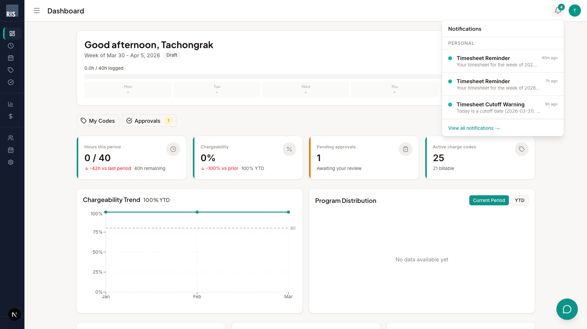

กดที่ **ไอคอนกระดิ่ง** มุมขวาบน → แผงแจ้งเตือนจะเลื่อนออกมาจากด้านขวา แสดงรายการแจ้งเตือนล่าสุด เช่น:

- สถานะ Pipeline (CI/CD)
- การอนุมัติที่รอดำเนินการ
- เตือนกำหนดส่ง

กด **"view all notifications →"** เพื่อดูทั้งหมด

---

## 4. การกรอกเวลา (Time Entry) 👤

> ทุกคนใช้หน้านี้

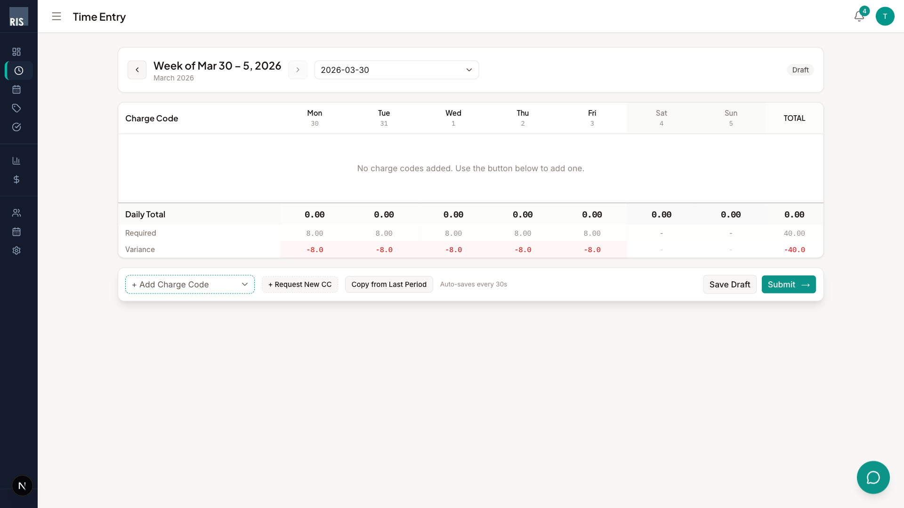

หน้า Time Entry เป็น **ตารางรายสัปดาห์** (Weekly Grid) สำหรับกรอกชั่วโมงทำงาน

### 4.1 เลือกสัปดาห์

| กดตรงไหน | ทำอะไร |
| --- | --- |
| ปุ่ม **< (ลูกศรซ้าย)** ข้าง "Week of..." | ย้อนไปสัปดาห์ก่อนหน้า |
| ปุ่ม **> (ลูกศรขวา)** | ไปสัปดาห์ถัดไป |
| ช่อง **วันที่ dropdown** (เช่น "2026-03-30") | เลือกสัปดาห์ที่ต้องการโดยตรง |

ด้านบนแสดงข้อความเช่น **"Week of Mar 30 – 5, 2026"** พร้อมเดือนกำกับ (เช่น "March 2026")

### 4.2 โครงสร้างตาราง

ตารางประกอบด้วย:

| ส่วน | รายละเอียด |
| --- | --- |
| **หัวคอลัมน์** | Charge Code, Mon–Sat (พร้อมวันที่ เช่น "Mon 30", "Tue 31") รวมถึง Sun |
| **แถวรหัสงาน** | แต่ละแถวคือรหัสงาน 1 ตัว มีช่องกรอกชั่วโมงรายวัน |
| **Daily Total** | แถวสรุปยอดรวมรายวัน (ตัวหนา) |
| **Required** | แถวแสดงชั่วโมงที่ต้องทำ (วันทำงานปกติ = 8.00, วันหยุด = –) |
| **Variance** | ส่วนต่าง = Daily Total − Required ถ้าติดลบจะแสดงเป็น **ตัวแดง** (เช่น −8.0) |

### 4.3 เพิ่มรหัสงาน (Add Charge Code)

1. กดปุ่ม **"+ Add Charge Code"** ด้านล่างซ้ายของตาราง
2. จะแสดงรายการรหัสงานที่คุณมีสิทธิ์ใช้ → กดเลือกรหัสที่ต้องการ
3. รหัสงานจะปรากฏเป็นแถวใหม่ในตาราง

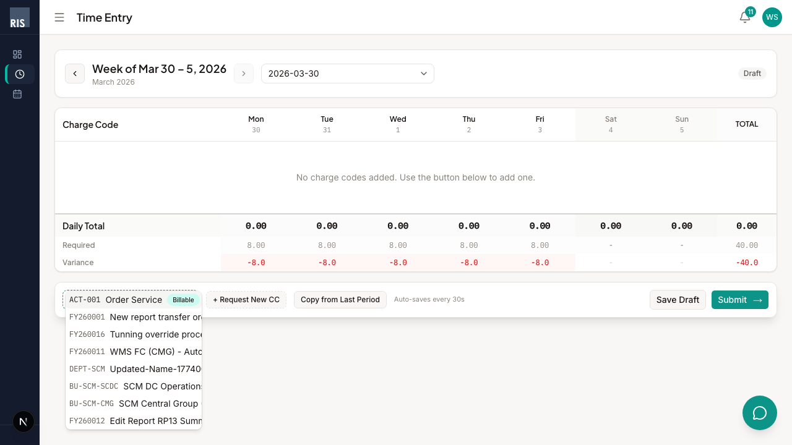

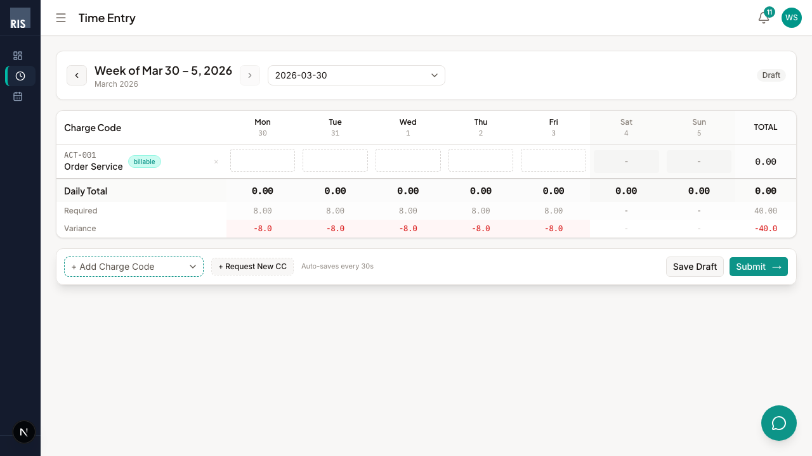

> **ข้อสังเกต:** ถ้ายังไม่มีรหัสงานเลย จะเห็นข้อความ *"No charge codes added. Use the button below to add one."*

### 4.4 กรอกชั่วโมง

1. **กดที่ช่องว่าง** ในตาราง (จุดตัดระหว่างรหัสงาน กับ วัน)
2. พิมพ์จำนวนชั่วโมง (เช่น 8.00, 4.50, 2.00)
3. กด Tab หรือ Enter เพื่อย้ายไปช่องถัดไป
4. ระบบจะคำนวณ **Daily Total** และ **Variance** ให้อัตโนมัติ

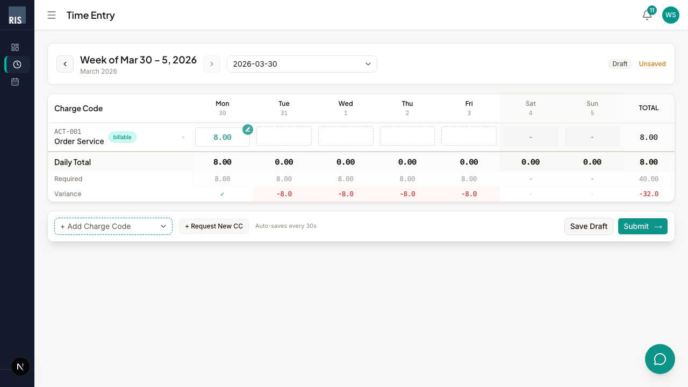

**เป้าหมาย:** ทุกวันทำงาน (จ.–ศ.) ควรมียอดรวม **8.00 ชั่วโมง** — เมื่อครบ Variance จะเป็น 0.00

### 4.5 ลบรหัสงานออกจากตาราง

กดปุ่ม **× (กากบาท)** ที่ท้ายแถวรหัสงาน เพื่อลบรหัสงานนั้นออก (ข้อมูลชั่วโมงที่กรอกไว้จะหายไป)

### 4.6 คัดลอกจากสัปดาห์ก่อน

ถ้าใบบันทึกเวลาเป็น Draft และยังไม่มีรหัสงาน จะเห็นปุ่ม **"Copy from Last Period"** → กดเพื่อคัดลอกรหัสงานจากสัปดาห์ก่อนมาใช้ได้เลย ช่วยประหยัดเวลาไม่ต้องเพิ่มรหัสงานใหม่ทุกสัปดาห์

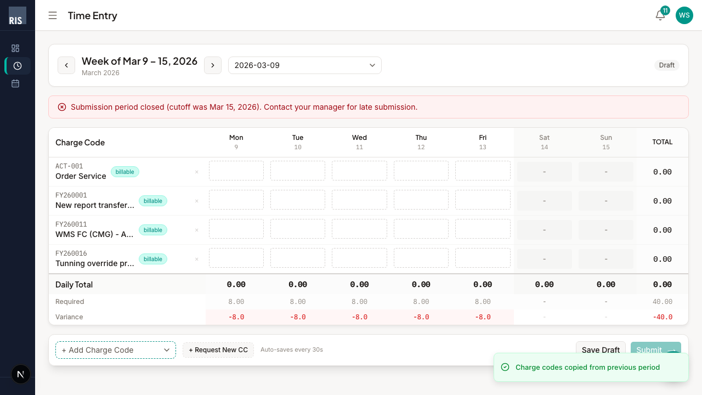

### 4.7 ขอใช้รหัสงานใหม่

กดปุ่ม **"+ Request New CC"** เพื่อส่งคำขอใช้รหัสงานใหม่ไปยังผู้ดูแล (ใช้เมื่อรหัสงานที่ต้องการไม่อยู่ในรายการ)

### 4.8 การบันทึก

| วิธี | รายละเอียด |
| --- | --- |
| **Auto-save** | ระบบบันทึกให้อัตโนมัติทุก 30 วินาที (แสดงข้อความ "Auto-saves every 30s" ด้านล่าง) |
| **Save Draft** | กดปุ่ม **"Save Draft"** เพื่อบันทึกร่างทันที |

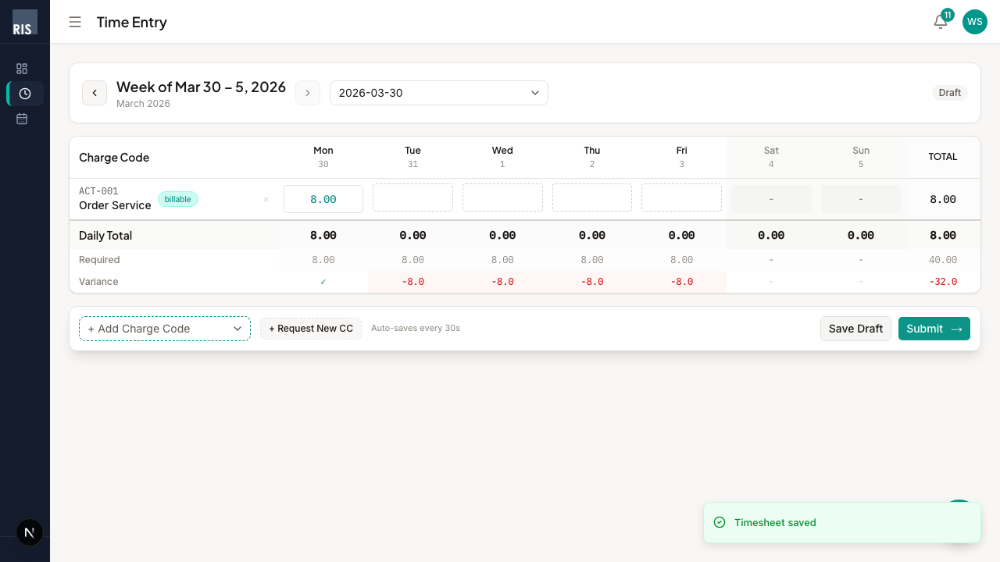

### 4.9 OT และชั่วโมงพิเศษ

เมื่อกรอกรวมเกิน 8 ชม. ในวันเดียว ระบบจะแสดง **Variance สีแดง** (ค่าติดลบ) แต่ **ไม่บล็อก** — สามารถบันทึกได้ตามปกติ

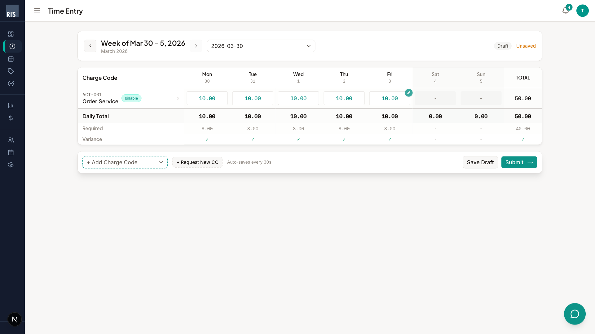

#### 4.9.1 การบันทึก OT (Overtime)

การบันทึกชั่วโมงทำงานล่วงเวลาทำได้ดังนี้:

1. ในหน้า **Time Entry** กรอกชั่วโมงที่ **เกิน 8 ชั่วโมง** ในวันทำงานปกติ
   - ตัวอย่าง: กรอก 10.00 ในวันจันทร์ → Variance จะแสดง +2.0
2. สำหรับ OT ในวันหยุด: กรอกชั่วโมงในคอลัมน์ **Sat** หรือ **Sun**
   - Required จะแสดง "–" (ไม่มีเป้าหมาย) แต่คุณยังกรอกชั่วโมงได้

#### 4.9.2 รหัสงานสำหรับ OT

- ใช้รหัสงานเดียวกับงานปกติ — ระบบจะรวมชั่วโมงทั้งหมดในสัปดาห์นั้น
- หากองค์กรมีรหัสงาน OT แยกต่างหาก ให้เพิ่มรหัสงานนั้นผ่าน **"+ Add Charge Code"**

#### 4.9.3 วันลาและวันหยุด

- ชั่วโมงที่ลาจะถูกจัดการผ่านหน้า **Calendar** (ดูหัวข้อ 8)
- วันหยุดราชการแสดงในปฏิทินเป็น **สีชมพู/แดง** — ไม่ต้องกรอกชั่วโมงในวันเหล่านี้
- ถ้ามีรหัสงานสำหรับลาป่วย/ลากิจ ให้เพิ่มในตาราง Time Entry เหมือนรหัสงานปกติ

### 4.10 การส่งอนุมัติ (Submit for Approval)

#### 4.10.1 ตรวจสอบก่อนส่ง

ก่อนส่งใบบันทึกเวลา ตรวจสอบว่า:

- ทุกวันทำงาน (จ.–ศ.) มียอด **Daily Total = 8.00** ชั่วโมง
- แถว **Variance** แสดง 0.00 หรือ ✓ (ไม่มีตัวแดง)
- รหัสงานครบถ้วน ถูกต้อง

#### 4.10.2 ขั้นตอนการส่ง

1. กดปุ่ม **"Submit →"** สีเขียว มุมขวาล่างของตาราง
2. ถ้ายังมีวันที่ไม่ครบ 8 ชม. → ระบบจะแสดง **หน้าต่างเตือน** → กด **"OK, Got It"** แล้วกลับไปกรอกให้ครบ

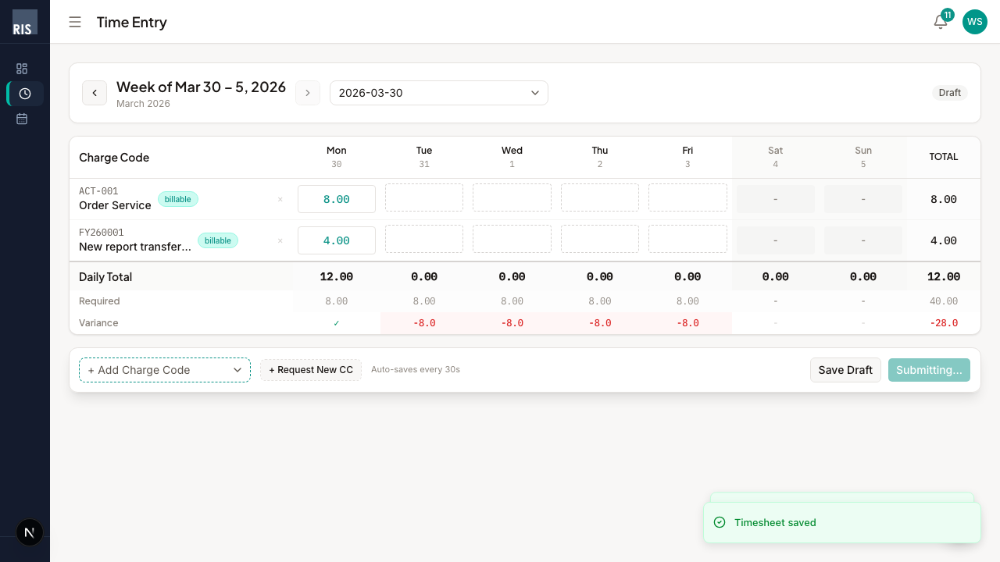

3. เมื่อส่งสำเร็จ:
   - สถานะจะเปลี่ยนเป็น **"Submitted"**
   - หัวหน้าจะได้รับแจ้งเตือน
   - คุณจะไม่สามารถแก้ไขได้จนกว่าหัวหน้าจะตีกลับ (Reject)

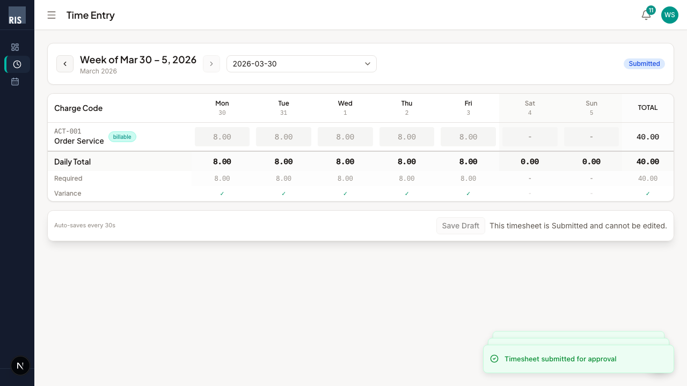

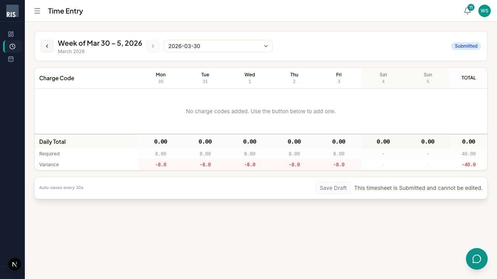

### 4.11 สถานะของใบบันทึกเวลา

| สถานะ | ป้ายสี | ความหมาย |
| --- | --- | --- |
| **Draft** | เทา | ร่าง — ยังแก้ไขได้ |
| **Submitted** | ฟ้า | ส่งแล้ว — รอหัวหน้าตรวจ |
| **Manager Approved** | น้ำเงินเขียว (Teal) | รอ CC Owner อนุมัติ |
| **CC Approved** | เขียวมรกต (Emerald) | CC Owner อนุมัติแล้ว รอ lock |
| **Approved** | เขียว | อนุมัติแล้ว |
| **Rejected** | แดง | ตีกลับ — ต้องแก้ไขแล้วส่งใหม่ |
| **Locked** | เทาเข้ม | ล็อกแล้ว — ไม่สามารถแก้ไขได้ |

### 4.12 กำหนดส่ง (Deadline)

- ถ้าใกล้ถึงกำหนดส่ง (ภายใน 3 วัน) จะมี **แถบสีเหลือง** เตือนด้านบน
- หลังเลยกำหนด จะมี **แถบสีแดง** บอกว่า "ปิดรับแล้ว" → ต้องติดต่อหัวหน้าเพื่อขอส่งย้อนหลัง

---

## 5. ฟีเจอร์ AI (AI-Powered Features) 👤

ระบบ Timesheet มีฟีเจอร์ AI ช่วยเหลือการทำงาน ลดขั้นตอน และเพิ่มความแม่นยำในการบันทึกเวลา


### 5.1 บันทึกเวลาด้วย AI (Record Time by AI)

AI สามารถช่วยกรอกชั่วโมงทำงานอัตโนมัติ โดยวิเคราะห์จากข้อมูลกิจกรรมของคุณ:

- **วิเคราะห์จากปฏิทิน** — ถ้าคุณมีนัดประชุมหรือ event ในปฏิทิน AI จะแนะนำชั่วโมงที่ควรกรอกในแต่ละวัน
- **เรียนรู้จาก pattern** — AI จดจำรูปแบบการทำงานของคุณ เช่น ถ้าปกติกรอก 8 ชม. ทุกวันจันทร์ถึงศุกร์ ระบบจะเสนอให้ auto-fill ได้เลย
- **ตรวจจับความผิดปกติ** — หาก AI พบว่าวันใดยังไม่มีการกรอกชั่วโมง จะแจ้งเตือนพร้อมคำแนะนำ เช่น "คุณยังไม่ได้กรอกวันพุธ — ปกติคุณบันทึก 8 ชม."

**วิธีใช้:**
1. เปิดหน้า **Time Entry** ตามปกติ
2. AI จะแสดงคำแนะนำชั่วโมงให้อัตโนมัติ (ถ้ามีข้อมูลเพียงพอ)
3. ตรวจสอบความถูกต้อง → กด **ยืนยัน** เพื่อใช้ค่าที่ AI แนะนำ หรือแก้ไขได้ตามต้องการ

> **หมายเหตุ:** AI เป็นผู้ช่วยแนะนำเท่านั้น — คุณยังคงตรวจสอบและยืนยันข้อมูลทุกครั้งก่อนส่ง

### 5.2 แนะนำ Charge Code อัตโนมัติ (Auto-Suggest Charge Codes)

เมื่อคุณเพิ่มรหัสงานหรือกรอกเวลา AI จะช่วยแนะนำ Charge Code ที่เหมาะสม:

- **แนะนำจากคำอธิบายงาน** — พิมพ์คำอธิบายสั้น ๆ เช่น "ทำงาน migration" → AI จะเสนอ Charge Code ที่ตรงกับงานนั้นโดยอิงจากประวัติการใช้งาน
- **แนะนำจากประวัติ** — Charge Code ที่คุณใช้บ่อยจะถูกเสนอก่อน ช่วยลดเวลาค้นหา
- **แนะนำจากทีม** — ถ้าเพื่อนร่วมทีมใช้ Charge Code ที่คุณยังไม่เคยใช้ AI อาจแนะนำให้ลอง

**วิธีใช้:**
1. กดปุ่ม **"+ Add Charge Code"** ในหน้า Time Entry
2. เริ่มพิมพ์ชื่อหรือคำอธิบายงาน → AI จะแสดงรายการแนะนำแบบ autocomplete
3. เลือกรหัสงานจากรายการ หรือพิมพ์รหัสเต็มด้วยตนเอง

### 5.3 AI Chatbot ช่วยเหลือ (AI Chatbot Assistance)

ระบบมี **Chat Widget** ในตัว สำหรับถามคำถามเกี่ยวกับ Timesheet ได้ทันทีโดยไม่ต้องออกจากหน้าที่ใช้งาน

**ความสามารถของ Chatbot:**

| สิ่งที่ถามได้ | ตัวอย่างคำถาม |
| --- | --- |
| **ดูสถานะ Timesheet** | "Timesheet สัปดาห์นี้ส่งหรือยัง?" |
| **ตรวจสอบ Chargeability** | "อัตรา chargeability ของฉันเท่าไหร่?" |
| **ดู Approval ค้าง** | "มีใบรออนุมัติกี่ใบ?" |
| **สอบถามงบประมาณ** | "โปรเจกต์ PRJ-001 งบเหลือเท่าไหร่?" |
| **ขอสรุป** | "สรุปชั่วโมงทำงานเดือนนี้ให้หน่อย" |

**วิธีใช้:**
1. กดไอคอน **💬 (Chat)** ที่มุมขวาล่างของหน้าจอ → แผง Chat จะเปิดขึ้น
2. พิมพ์คำถามเป็นภาษาธรรมชาติ (ไทยหรืออังกฤษ)
3. Chatbot จะตอบกลับพร้อม **ปุ่มลัด** (Suggested Actions) สำหรับคำถามที่เกี่ยวข้อง
4. กด Suggested Action เพื่อถามต่อได้ทันที

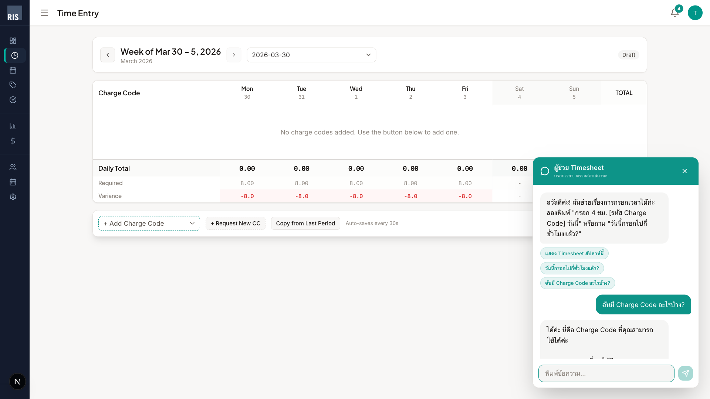

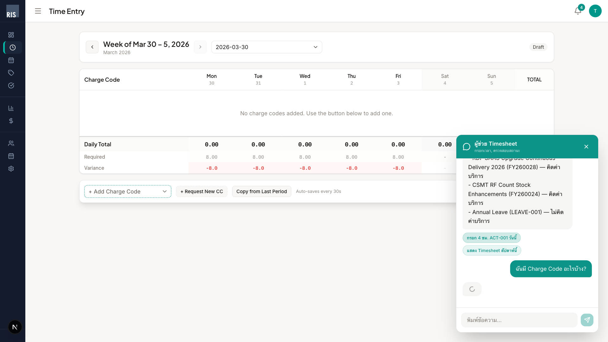

> **หมายเหตุ:** Chatbot แสดงข้อมูลเฉพาะที่คุณมีสิทธิ์เข้าถึงเท่านั้น — พนักงานเห็นเฉพาะข้อมูลของตัวเอง หัวหน้าเห็นข้อมูลทีม

---

## 6. การอนุมัติ (Approval Workflow) 👔

> สำหรับ **หัวหน้างาน** (Charge Manager) และ **ผู้ดูแลระบบ** (Admin)

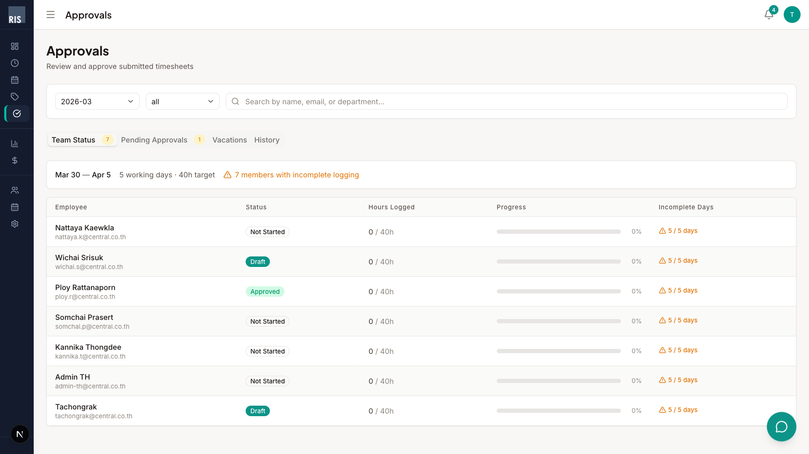

### 6.1 ภาพรวมหน้า Approvals

หน้า Approvals มีส่วนหลัก:

- **หัวข้อ**: "Approvals — Review and approve submitted timesheets"
- **ตัวกรอง** (ด้านบน):
  - Dropdown เดือน เช่น `2026-03`
  - Dropdown สถานะ เช่น `all`
  - ช่องค้นหาชื่อ อีเมล หรือแผนก

### 6.2 แท็บต่าง ๆ

| แท็บ | คำอธิบาย |
| --- | --- |
| **Team Status** (ค่าเริ่มต้น) | ดูว่าลูกทีมแต่ละคนบันทึกเวลาครบหรือไม่ มีตัวเลขสีส้มบอกจำนวนทีม |
| **Pending Approvals** | ใบบันทึกเวลาที่รอคุณอนุมัติ (มีตัวเลขสีส้มบอกจำนวน) |
| **Vacations** | คำขอลาที่รอคุณอนุมัติ |
| **History** | ประวัติที่คุณเคยอนุมัติ/ตีกลับ |

### 6.3 แท็บ Team Status

แสดงสรุปสัปดาห์ปัจจุบัน:

| ข้อมูล | ตัวอย่าง |
| --- | --- |
| **ช่วงวันที่** | "Mar 30 — Apr 5" |
| **จำนวนวันทำงาน** | "5 working days" |
| **เป้าหมาย** | "40h target" |
| **สถานะทีม** | เช่น "⚠ 7 members with incomplete logging" (สีส้ม) |

ตารางด้านล่างแสดงรายชื่อพนักงาน:

| คอลัมน์ | ความหมาย |
| --- | --- |
| **Employee** | ชื่อ + อีเมล |
| **Status** | สถานะ เช่น Not Started, Draft, Submitted |
| **Hours Logged** | ชั่วโมงที่กรอก / เป้าหมาย เช่น "0 / 40h" |
| **Progress** | แถบเปอร์เซ็นต์ เช่น 0% |

### 6.4 อนุมัติทีละใบ

1. กดแท็บ **"Pending Approvals"**
2. กด **ไอคอนตา** ด้านขวาของแต่ละแถว เพื่อดูรายละเอียด
3. กดปุ่ม **✓ (อนุมัติ)** หรือ **✗ (ตีกลับ)**
   - ถ้าตีกลับ สามารถเขียนเหตุผลให้พนักงานรู้ได้

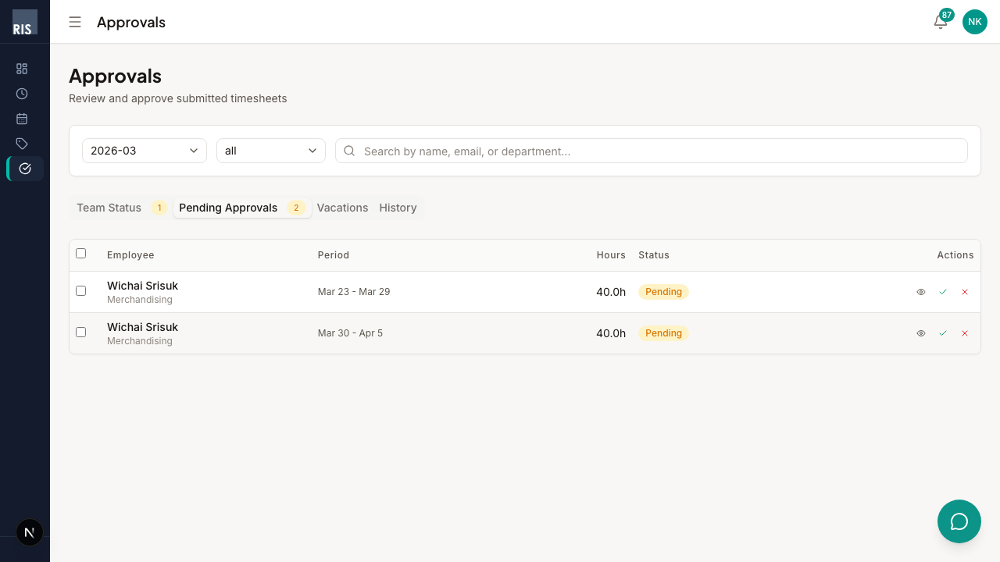

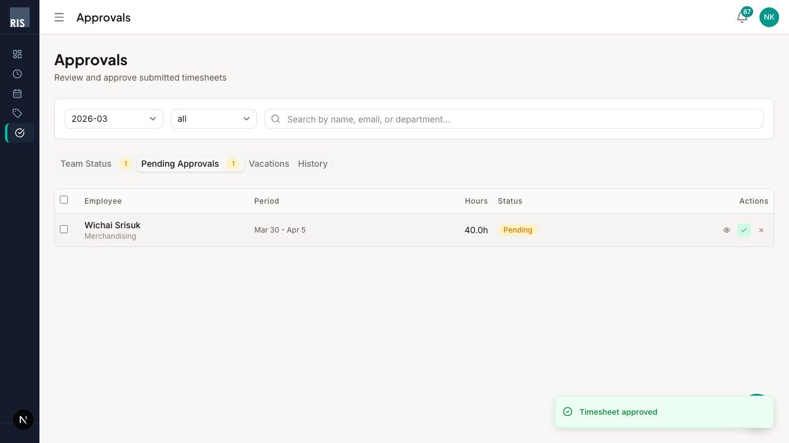

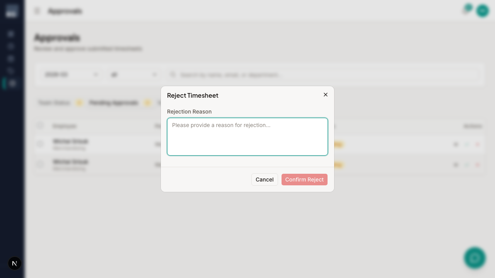

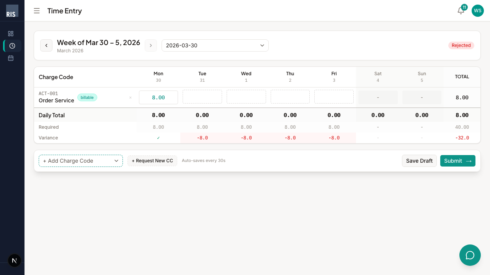

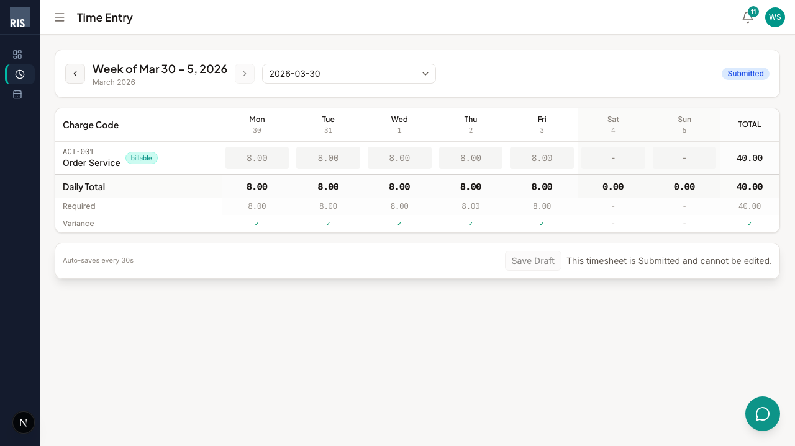

### 6.5 อนุมัติทีเดียวหลายใบ (Bulk Approve)

1. **ติ๊กช่องเลือก** หน้าแต่ละแถวที่ต้องการ
2. จะมี **แถบอนุมัติรวม** ขึ้นมาด้านล่าง
3. กดปุ่มอนุมัติรวม เพื่ออนุมัติทั้งหมดที่เลือก

### 6.6 อนุมัติวันลา

1. กดแท็บ **"Vacations"**
2. ดูชื่อพนักงาน วันที่ลา ประเภทการลา
3. กดปุ่ม **"Approve"** หรือ **"Reject"** ที่แต่ละรายการ

### 6.7 ลำดับขั้นตอนการอนุมัติ (Workflow)

```
พนักงานกรอกเวลา → กด Submit
        ↓
หัวหน้า (Charge Manager) ตรวจสอบ
        ↓
   ┌────────────┐
   │ Approve ✓  │ → สถานะ = Manager Approved → ส่งต่อ CC Owner
   └────────────┘
   ┌────────────┐
   │ Reject ✗   │ → สถานะ = Rejected → พนักงานแก้ไขแล้วส่งใหม่
   └────────────┘
        ↓ (กรณี Approve)
CC Owner (เจ้าของ Cost Center) ตรวจสอบ
        ↓
   ┌────────────┐
   │ Approve ✓  │ → สถานะ = CC Approved → ล็อกใบ
   └────────────┘
   ┌────────────┐
   │ Reject ✗   │ → สถานะ = Rejected → พนักงานแก้ไขแล้วส่งใหม่
   └────────────┘
```

---

## 7. รหัสงาน (Charge Codes) 👔⚙️

> สำหรับ **หัวหน้างาน** (Charge Manager), **ผู้ดูแล** (Admin), PMO, Finance

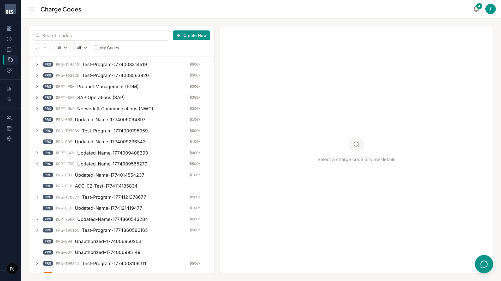

### 7.1 โครงสร้างรหัสงาน

| ระดับ | ป้าย | ตัวอย่าง |
| --- | --- | --- |
| **โปรแกรม** (Program) | `PRG` สีเขียว | "PRG-T14519 Test-Prog..." — งานใหญ่สุด |
| **แผนก** (Department) | `DEPT` สีเขียว | "DEPT-PDM Product Ma..." |
| **โปรเจกต์** (Project) | `PRJ` | โปรเจกต์ย่อยภายในโปรแกรม |
| **กิจกรรม** (Activity) | `ACT` สีส้ม | เช่น "Development", "Testing" |
| **งานย่อย** (Task) | `TSK` | รายการงานเฉพาะ |

### 7.2 ค้นหาและกรอง

| กดตรงไหน | ทำอะไร |
| --- | --- |
| ช่อง **"Search codes..."** (ด้านบนซ้าย) | พิมพ์ชื่อหรือรหัสเพื่อค้นหา |
| **dropdown 3 ช่อง** (all / all / all) | กรองตามระดับ, สถานะ, ประเภท |
| ช่องติ๊ก **"My Codes"** | แสดงเฉพาะรหัสงานที่มอบหมายให้คุณ |
| ปุ่ม **"+ Create New"** สีเขียว | สร้างรหัสงานใหม่ (เฉพาะผู้ดูแล) |

### 7.3 ดูรายละเอียดรหัสงาน

- กดที่ **ชื่อรหัสงาน** ในรายการ → แผงรายละเอียดจะเปิดทางด้านขวา แสดงข้อมูล เช่น งบประมาณ (เช่น ฿500K, ฿300K)
- กดปุ่ม **ลูกศร >** หน้ารหัสงาน → ขยายดูโปรเจกต์/กิจกรรมย่อยภายใน

> **ข้อสังเกต:** ถ้ายังไม่ได้เลือกรหัสงาน จะเห็นข้อความ *"Select a charge code to view details"* พร้อมไอคอนแว่นขยาย

### 7.4 สร้างรหัสงานใหม่ (เฉพาะผู้ดูแล)

1. กดปุ่ม **"+ Create New"** สีเขียว (มุมขวาบน)
2. กรอก: ชื่อ, ระดับ, รหัสงานแม่, งบประมาณ, ประเภท (Billable / Non-billable), วันเริ่ม-สิ้นสุด
3. กดบันทึก

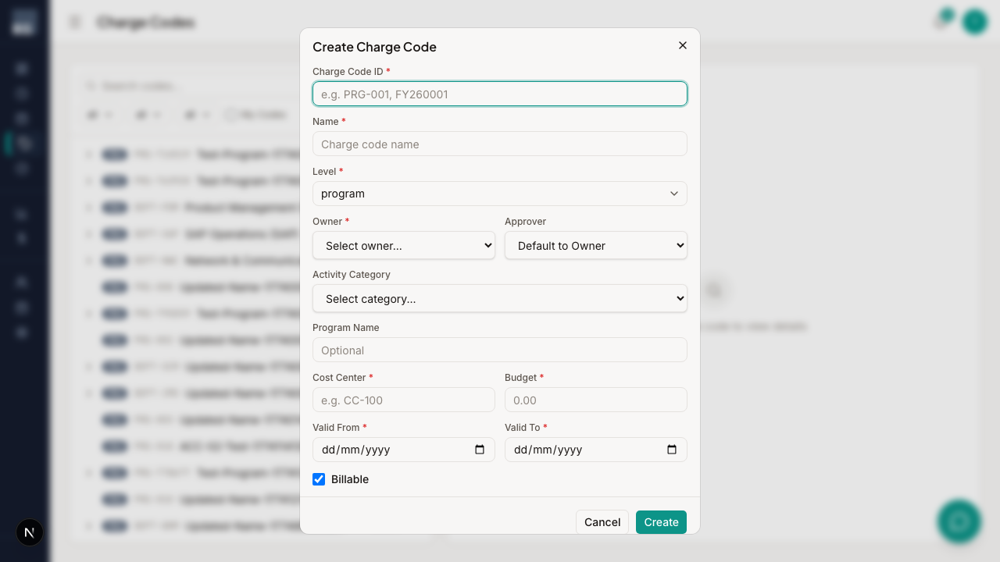

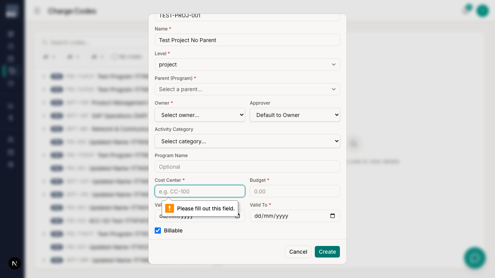

---

## 8. ปฏิทินและวันลา 👤👔

> ทุกคนใช้หน้านี้

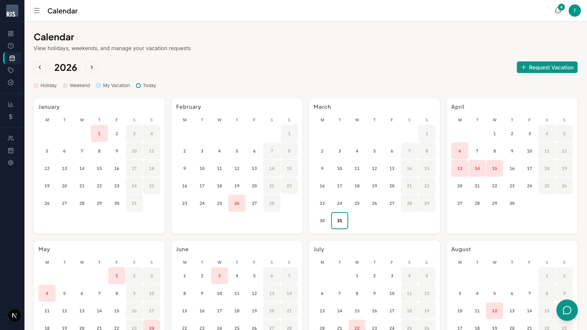

### 8.1 อ่านปฏิทิน

หน้า Calendar แสดงปฏิทินทั้งปี (12 เดือน) พร้อมคำอธิบาย "View holidays, weekends, and manage your vacation requests"

**สัญลักษณ์สี:**

| สี/เครื่องหมาย | ความหมาย |
| --- | --- |
| วงกลม **สีชมพู/แดง** (Holiday) | วันหยุดราชการ เช่น วันขึ้นปีใหม่ วันสงกรานต์ |
| พื้นหลัง **สีเทา** (Weekend) | วันเสาร์-อาทิตย์ |
| วงกลม **สีฟ้าอ่อน** (My Vacation) | วันลาของคุณ |
| วงกลม **สีเขียว/ขอบเขียว** (Today) | วันนี้ |

- กดปุ่ม **< >** ข้าง ปี (เช่น "2026") เพื่อเปลี่ยนปี

### 8.2 ขอลาพักร้อน

1. กดปุ่ม **"+ Request Vacation"** สีเขียว (มุมขวาบนของปฏิทิน)
2. เลือก **วันเริ่ม** และ **วันสิ้นสุด**
3. เลือกประเภท: **ลาเต็มวัน** / **ลาครึ่งวันเช้า** / **ลาครึ่งวันบ่าย**
4. กดส่ง → คำขอจะถูกส่งไปให้หัวหน้าอนุมัติ

### 8.3 ประวัติวันลา

ด้านล่างปฏิทิน (ส่วน **"My Vacation Requests"**) แสดงรายการวันลาทั้งหมดของคุณ พร้อมสถานะ (Pending / Approved / Rejected)

---

## 9. รายงาน (Reports & Analytics) 📊

> สำหรับ **ผู้บริหาร, ฝ่ายวางแผน (PMO), และการเงิน** (Finance)

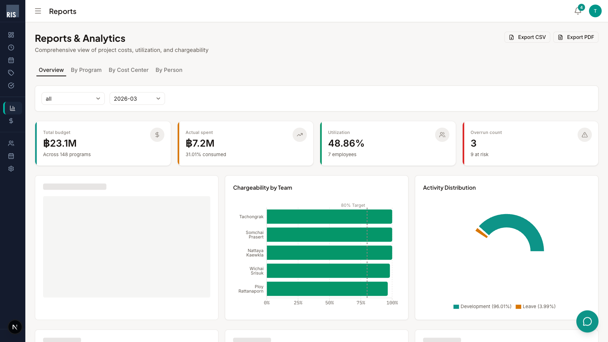

### 9.1 ภาพรวม (แท็บ Overview)

หน้า Reports แสดงหัวข้อ **"Reports & Analytics"** พร้อมคำอธิบาย "Comprehensive view of project costs, utilization, and chargeability"

**ตัวกรอง:**

- Dropdown **หน่วยงาน** (เช่น "all") + Dropdown **เดือน** (เช่น "2026-03")
- ปุ่ม **"Export..."** มุมขวาบน สำหรับดาวน์โหลดข้อมูล

**4 กล่องสรุป KPI:**

| กล่อง | ตัวอย่าง | ความหมาย |
| --- | --- | --- |
| **Total budget** | ฿21.9M — "Across 142 programs" | งบประมาณรวมทุกโปรแกรม |
| **Actual spent** | ฿7.2M — "32.81% consumed" | ค่าใช้จ่ายจริง + เปอร์เซ็นต์ที่ใช้ไป |
| **Utilization** | 48.86% — "7 employees" | อัตราใช้กำลังคน |
| **Over budget** | 3 — "10 at risk" | จำนวนรหัสงานที่เกินงบ + เสี่ยงเกินงบ |

### 9.2 แท็บต่าง ๆ

| แท็บ | ทำอะไร |
| --- | --- |
| **Overview** | ภาพรวมทั้งหมด — กราฟ Budget vs Actual, Chargeability by Team, Activity Distribution |
| **By Program** | เลือกโปรแกรม → ดูรายละเอียดชั่วโมง ค่าใช้จ่าย แยกตามโปรเจกต์/กิจกรรม |
| **By Cost Center** | เลือกหน่วยงาน → ดูค่าใช้จ่ายแยกตามแผนก (เหมาะสำหรับฝ่ายการเงิน) |
| **By Person** | ค้นหาชื่อบุคคล → ดูชั่วโมง อัตรา charge งาน รหัสงานที่ใช้ |

### 9.3 ส่งออกข้อมูล (Export)

กดปุ่ม **"Export..."** มุมขวาบน → เลือก:
- **Export CSV** — ดาวน์โหลดเป็นตาราง (เปิดใน Excel ได้)
- **Export PDF** — สร้างรายงานแบบพิมพ์ได้

---

## 10. งบประมาณ (Budget) 📊

> สำหรับ **ผู้บริหาร, PMO, และการเงิน**

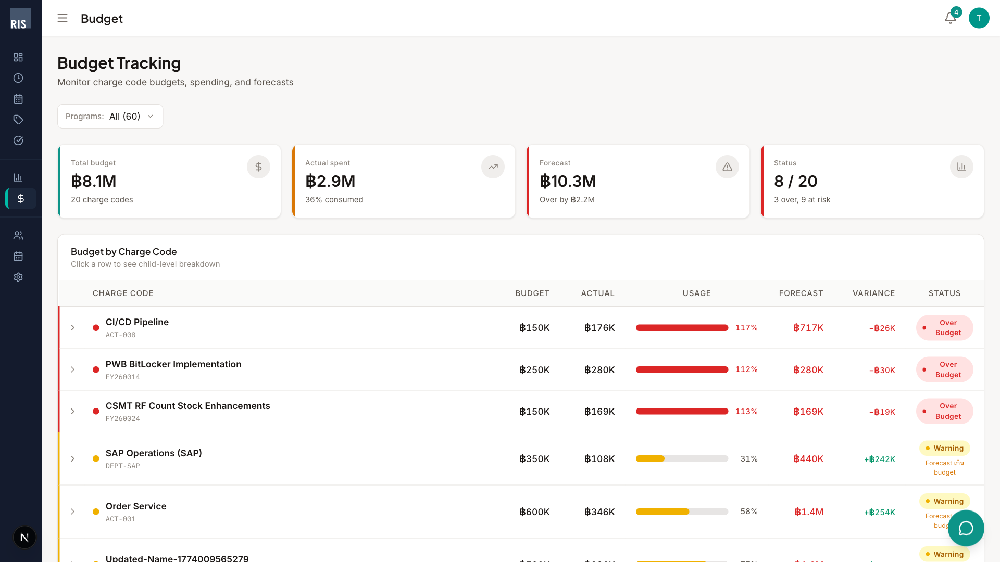

### 10.1 ภาพรวมหน้า Budget

หน้า Budget Tracking แสดงหัวข้อ **"Budget Tracking"** พร้อมคำอธิบาย "Monitor charge code budgets, spending, and forecasts"

**ตัวกรอง:**

- Dropdown **"Programs"** — เลือกโปรแกรมหรือ "All (56)" เพื่อดูทั้งหมด

**กล่องสรุป KPI:**

| กล่อง | ตัวอย่าง | ความหมาย |
| --- | --- | --- |
| **Total budget** | ฿8.2M — "20 charge codes" | งบรวมทั้งหมด |
| **Actual spent** | ฿3.1M — "37% consumed" | ค่าใช้จ่ายจริง |
| **Forecast** | ฿11.1M — "Over by ฿2.8M" | คาดการณ์ค่าใช้จ่าย |
| **Status** | 7... — "3 over" | สถานะงบแยกตามสี |

### 10.2 ตาราง Budget by Charge Code

แสดงข้อความ "Click a row to see child-level breakdown" — กดแถวไหนก็ได้เพื่อขยายดูรายละเอียด

| คอลัมน์ | ความหมาย |
| --- | --- |
| **Charge Code** | ชื่อและรหัสงาน |
| **Budget** | งบที่ตั้งไว้ |
| **Actual** | ค่าใช้จ่ายจริง |
| **Usage** | แถบสี + เปอร์เซ็นต์การใช้งบ |
| **Forecast** | ค่าใช้จ่ายที่คาดการณ์ |
| **Variance** | ส่วนต่าง (+ = เหลืองบ, − = เกินงบ) |
| **Status** | ป้ายสีแสดงสถานะ |

### 10.3 ความหมายสี Status

| สี | ป้าย | ความหมาย |
| --- | --- | --- |
| เขียว | **On Track** | ปกติ ยังอยู่ในงบ |
| เหลือง | **Warning** | ใช้เกิน 80% — ควรระวัง |
| ส้ม | **Forecast Over** | คาดว่าจะเกินงบ |
| แดง | **Over Budget** | เกินงบแล้ว |

---

## 11. การตั้งค่า (Settings) 👤👔⚙️📊

> ทุกคนสามารถตั้งค่าได้

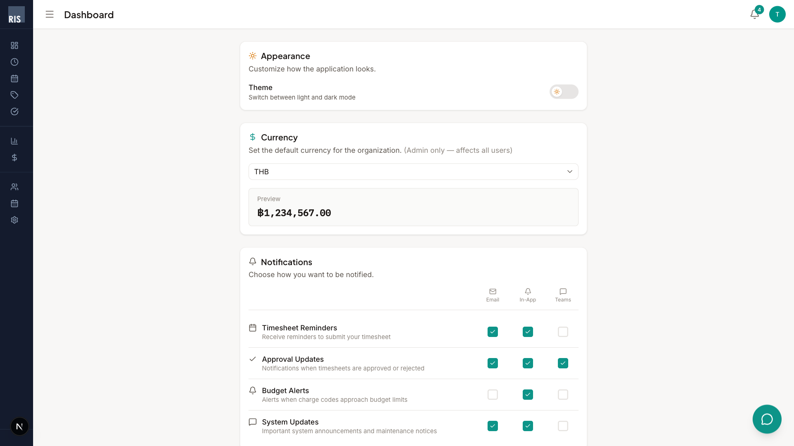

### 11.1 Appearance (ลักษณะหน้าจอ)

| การตั้งค่า | วิธีเปลี่ยน |
| --- | --- |
| **Theme** | กดปุ่มสลับ (toggle) เพื่อเปลี่ยนระหว่าง Light (สว่าง) และ Dark (มืด) |

### 11.2 Currency (สกุลเงิน)

- เลือกสกุลเงินเริ่มต้นขององค์กร เช่น **THB**
- ด้านล่างแสดง **Preview** ตัวอย่างรูปแบบตัวเลข เช่น `฿1,234,567.00`
- **หมายเหตุ:** การเปลี่ยนสกุลเงินเป็นสิทธิ์ของ Admin เท่านั้น — จะมีข้อความ "(Admin only — affects all users)" กำกับ
---

## 12. จัดการระบบ (Admin) ⚙️

> สำหรับ **ผู้ดูแลระบบ** (Admin) เท่านั้น

### 12.1 จัดการผู้ใช้ (Admin > Users)

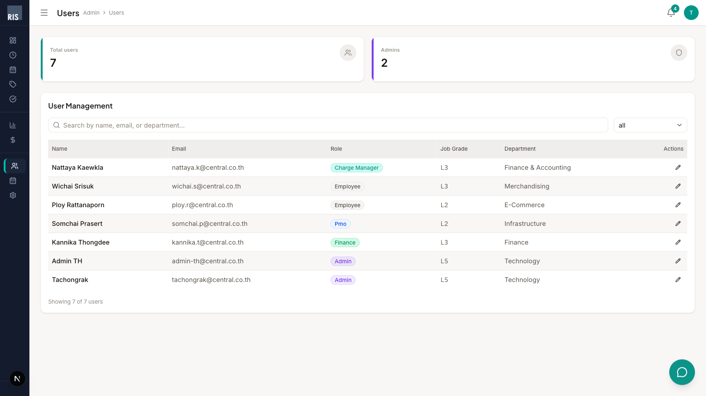

**กล่องสรุป:**
- **Total users** — จำนวนผู้ใช้ทั้งหมด (เช่น 7)
- **Admins** — จำนวนผู้ดูแลระบบ (เช่น 2)

**ตาราง User Management:**

| คอลัมน์ | ความหมาย |
| --- | --- |
| **Name** | ชื่อ-นามสกุล |
| **Email** | อีเมลองค์กร |
| **Role** | ตำแหน่งในระบบ เช่น `Charge Manager` (ป้ายสีเขียว), `Employee` |
| **Job Grade** | ระดับงาน เช่น L2, L3 |
| **Department** | แผนก เช่น Finance & Accounting, Merchandising, E-Commerce |

- ใช้ช่อง **"Search by name, email, or department..."** เพื่อค้นหา

### 12.2 จัดการปฏิทิน (Admin > Calendar)

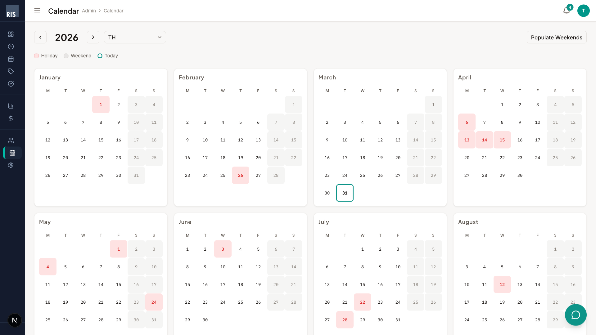

- แสดงปฏิทินทั้งปีเหมือนหน้า Calendar ของพนักงาน แต่มี dropdown เลือก **ประเทศ** (เช่น "TH") สำหรับกำหนดวันหยุดราชการ
- Breadcrumb แสดง "Admin > Calendar"
- สัญลักษณ์สี: Holiday (ชมพู), Weekend (เทา), Today (เขียว)
- ผู้ดูแลสามารถ **เพิ่ม/ลบวันหยุด** ได้จากหน้านี้

### 12.3 จัดการอัตราค่าใช้จ่าย (Admin > Rates)

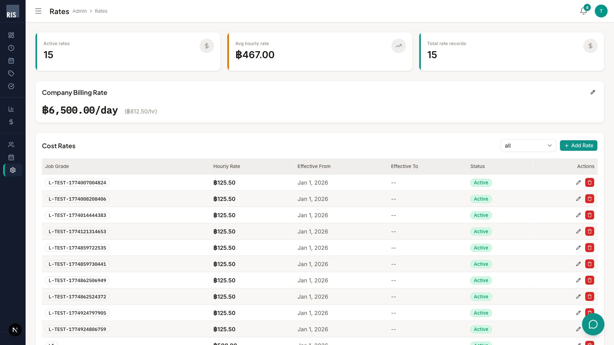

**กล่องสรุป:**
- **Active rates** — จำนวนอัตราที่ใช้งาน (เช่น 13)
- **Avg hourly rate** — อัตราเฉลี่ยต่อชั่วโมง (เช่น ฿519.54)
- **Total rate records** — จำนวนรายการทั้งหมด

**Company Billing Rate:**
- แสดงอัตราเรียกเก็บของบริษัท เช่น **฿6,500.00/day** (฿812.50/hr)

**ตาราง Cost Rates:**

| คอลัมน์ | ความหมาย |
| --- | --- |
| **Job Grade** | ระดับงาน |
| **Hourly Rate** | อัตราต่อชั่วโมง เช่น ฿125.50 |
| **Effective From** | วันที่เริ่มใช้ เช่น Jan 1, 2026 |
| **Effective To** | วันที่สิ้นสุด (ถ้าไม่มี = ใช้ไปเรื่อย ๆ) |
| **Status** | สถานะ `Active` (สีเขียว) |

- ใช้ dropdown **"all"** เพื่อกรองตาม Job Grade

---

## 13. สิทธิ์การใช้งานตามบทบาท 👤👔⚙️📊

ระบบแบ่งสิทธิ์ตามตำแหน่ง — ไม่ใช่ทุกคนจะเห็นทุกเมนู:

| ตำแหน่ง | Dashboard | Time Entry | Calendar | Charge Codes | Approvals | Reports | Budget | Admin |
| --- | --- | --- | --- | --- | --- | --- | --- | --- |
| **พนักงาน** (Employee) | ✅ | ✅ | ✅ | — | — | — | — | — |
| **หัวหน้างาน** (Charge Manager) | ✅ | ✅ | ✅ | ✅ | ✅ | — | — | — |
| **ฝ่ายวางแผน** (PMO) | ✅ | ✅ | ✅ | ✅ | — | ✅ | ✅ | — |
| **ฝ่ายการเงิน** (Finance) | ✅ | ✅ | ✅ | ✅ | — | ✅ | ✅ | — |
| **ผู้ดูแลระบบ** (Admin) | ✅ | ✅ | ✅ | ✅ | ✅ | ✅ | ✅ | ✅ |

---

## 14. สรุปขั้นตอนประจำสัปดาห์ 👤👔⚙️📊

### พนักงาน — ทำทุกสัปดาห์

| วัน | ทำอะไร | กดตรงไหน |
| --- | --- | --- |
| **จ.** | เพิ่มรหัสงาน | กด **"+ Add Charge Code"** หรือ **"Copy from Last Period"** |
| **จ.–ศ.** | กรอกชั่วโมงทุกวัน | กดช่องในตาราง → พิมพ์ชั่วโมง |
| **ศ.** | ตรวจยอดรวม | ดูแถว Daily Total — ทุกวันต้อง 8.00, Variance ต้องไม่ติดลบ |
| **ศ.** | ส่งใบ | กดปุ่ม **"Submit →"** สีเขียว |
| | รอผล | หัวหน้าอนุมัติ → ได้แจ้งเตือน |

### หัวหน้างาน — ทำทุกสัปดาห์

| ขั้นตอน | ทำอะไร | กดตรงไหน |
| --- | --- | --- |
| 1 | ดูสถานะทีม | ไปหน้า **Approvals** → แท็บ **"Team Status"** |
| 2 | ตรวจใบที่ส่งมา | กดแท็บ **"Pending Approvals"** |
| 3 | ดูรายละเอียด | กด **ไอคอนตา** ที่แต่ละแถว |
| 4 | อนุมัติ/ตีกลับ | กดปุ่ม **✓** หรือ **✗** |
| 5 | ตรวจวันลา | กดแท็บ **"Vacations"** → กด Approve/Reject |

### ผู้บริหาร / การเงิน — ทำทุกเดือน

| ขั้นตอน | ทำอะไร | กดตรงไหน |
| --- | --- | --- |
| 1 | ดูภาพรวมตัวเลข | ไปหน้า **Reports** → แท็บ **"Overview"** |
| 2 | ดูแยกตามโปรแกรม | กดแท็บ **"By Program"** → เลือกโปรแกรม |
| 3 | ดูงบประมาณ | ไปหน้า **Budget** → ดูตาราง + สถานะสี |
| 4 | ส่งออกข้อมูล | กดปุ่ม **"Export..."** มุมขวาบน |

