# คู่มือการใช้งานระบบ Timesheet

> **เวอร์ชัน**: 3.0 ภาษาไทย
> **อัปเดตล่าสุด**: 22 มีนาคม 2026

---

## สารบัญ

1. [เริ่มต้นใช้งาน](#1-เริ่มต้นใช้งาน)
2. [หน้าหลัก (Dashboard)](#2-หน้าหลัก)
3. [บันทึกเวลาทำงาน](#3-บันทึกเวลาทำงาน)
4. [ปฏิทินและวันลา](#4-ปฏิทินและวันลา)
5. [อนุมัติใบบันทึกเวลา (สำหรับหัวหน้างาน)](#5-อนุมัติใบบันทึกเวลา)
6. [จัดการรหัสงาน (สำหรับผู้ดูแล)](#6-จัดการรหัสงาน)
7. [รายงาน (สำหรับผู้บริหาร/การเงิน)](#7-รายงาน)
8. [งบประมาณ (สำหรับผู้บริหาร/การเงิน)](#8-งบประมาณ)
9. [การแจ้งเตือน](#9-การแจ้งเตือน)
10. [ตั้งค่าโปรไฟล์](#10-ตั้งค่าโปรไฟล์)
11. [สิทธิ์การใช้งานตามตำแหน่ง](#11-สิทธิ์การใช้งานตามตำแหน่ง)
12. [สรุปขั้นตอนการใช้งานประจำสัปดาห์](#12-สรุปขั้นตอนการใช้งาน)

---

## 1. เริ่มต้นใช้งาน

### 1.1 เข้าสู่ระบบ

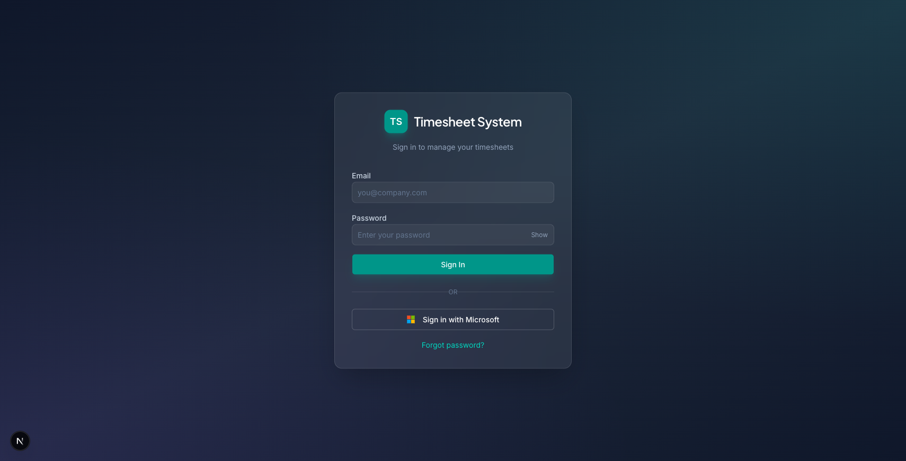

**ขั้นตอน:**

1. เปิดเว็บไซต์ระบบ Timesheet ขององค์กร
2. กรอก **อีเมล** ในช่องแรก (ตัวอย่าง: you@company.com)
3. กรอก **รหัสผ่าน** ในช่องที่สอง
   - กดปุ่ม **"Show"** ด้านขวาของช่องรหัสผ่าน เพื่อแสดงรหัสผ่านที่พิมพ์
4. กดปุ่มสีเขียว **"Sign In"**

**วิธีอื่น:**

- กดปุ่ม **"Sign in with Microsoft"** (ปุ่มสีขาวมีโลโก้ Microsoft) เพื่อเข้าด้วยบัญชี Microsoft ขององค์กร
- ถ้าลืมรหัสผ่าน กดลิงก์ **"Forgot password?"** ด้านล่าง → ระบบจะส่งอีเมลให้ตั้งรหัสผ่านใหม่

### 1.2 ส่วนต่าง ๆ ของหน้าจอ

เมื่อเข้าสู่ระบบแล้ว จะเห็น:

- **แถบเมนูด้านซ้าย** — ไอคอนสำหรับเปิดหน้าต่าง ๆ (บางเมนูจะมองเห็นเฉพาะบางตำแหน่ง)
- **แถบด้านบน** — ชื่อหน้าที่เปิดอยู่ + ปุ่มกระดิ่ง (แจ้งเตือน) + รูปโปรไฟล์ (มุมขวาบน)
- **ปุ่มแชทมุมขวาล่าง** — กดเพื่อคุยกับ JARVIS ผู้ช่วย AI

### 1.3 ออกจากระบบ

กดที่ **รูปโปรไฟล์ (ตัวอักษรย่อ)** ที่มุมขวาบน → เลือก **"Log out"**

---

## 2. หน้าหลัก

> 👤 **ทุกคน** เห็นหน้านี้

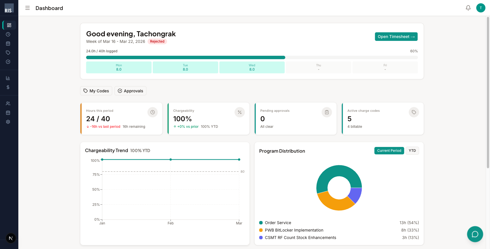

หน้าหลักแสดงภาพรวมการทำงานของคุณในสัปดาห์ปัจจุบัน:

| ตำแหน่งบนหน้าจอ | สิ่งที่แสดง |
|-----------------|-----------|
| **ด้านบน** | คำทักทาย + ช่วงวันที่ + สถานะ (เช่น Rejected) + ปุ่ม **"Open Timesheet →"** กดเพื่อไปหน้าบันทึกเวลา |
| **แถบความคืบหน้า** | ชั่วโมงที่บันทึกแล้ว (เช่น 24.0h / 40h) พร้อมแสดงรายวัน จ.–ศ. |
| **ปุ่มลัด** | **"My Codes"** (ดูรหัสงานของฉัน) และ **"Approvals"** (ดูใบรออนุมัติ) |
| **4 กล่องตัวเลข** | ชั่วโมงที่บันทึก, อัตรา charge งาน, ใบรออนุมัติ, จำนวนรหัสงาน |
| **กราฟซ้าย** | แนวโน้มอัตรา charge งานรายเดือน (เส้นประ = เป้า 80%) |
| **กราฟขวา** | สัดส่วนชั่วโมงแยกตามโปรแกรม (กด **"Current Period"** / **"YTD"** เพื่อสลับมุมมอง) |

---

## 3. บันทึกเวลาทำงาน

> 👤 **ทุกคน** ใช้หน้านี้

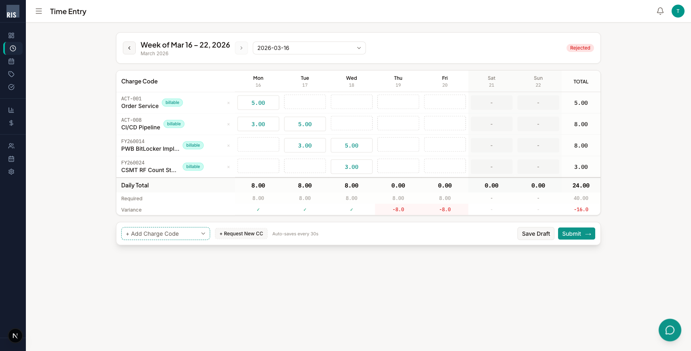

### 3.1 เลือกสัปดาห์

| กดตรงไหน | ทำอะไร |
|---------|--------|
| ปุ่ม **< (ลูกศรซ้าย)** ข้าง "Week of..." | ย้อนไปสัปดาห์ก่อนหน้า |
| ปุ่ม **> (ลูกศรขวา)** | ไปสัปดาห์ถัดไป (ไม่เกินสัปดาห์ปัจจุบัน) |
| ช่อง **วันที่** (เช่น "2026-03-16") | เลือกสัปดาห์ที่ต้องการโดยตรง |
| ป้ายสี **มุมขวา** (เช่น "Rejected") | แสดงสถานะ: Draft / Submitted / Approved / Rejected / Locked |

### 3.2 กรอกชั่วโมง

**ขั้นตอน:**

1. กดปุ่ม **"+ Add Charge Code"** (ด้านล่างซ้ายของตาราง) → เลือกรหัสงานจากรายการ
2. **กดที่ช่องว่าง** ในตาราง (จุดตัดระหว่างรหัสงาน กับ วัน) → พิมพ์จำนวนชั่วโมง (เช่น 5.00, 3.00)
3. ดูยอดรวมที่แถว **"Daily Total"** — ถ้าวันไหนยังไม่ครบ 8 ชม. จะเห็นตัวเลขสีแดงที่แถว **"Variance"**
4. กดปุ่ม **× (กากบาท)** ที่ท้ายรหัสงาน เพื่อลบรหัสงานออกจากตาราง

**ปุ่มอื่น ๆ ด้านล่าง:**

| ปุ่ม | ทำอะไร |
|------|--------|
| **"+ Request New CC"** | ขอใช้รหัสงานใหม่ (ส่งคำขอไปผู้ดูแล) |
| **"Save Draft"** | บันทึกร่างทันที |
| **"Submit →"** (ปุ่มสีเขียว) | ส่งใบบันทึกเวลาให้หัวหน้าอนุมัติ |

> ข้อความ **"Auto-saves every 30s"** ด้านล่าง = ระบบบันทึกให้อัตโนมัติทุก 30 วินาที ไม่ต้องกลัวข้อมูลหาย

### 3.3 ส่งใบบันทึกเวลา

1. ตรวจว่าทุกวันทำงาน (จ.–ศ.) มียอดรวมครบ **8 ชั่วโมง** (ดูแถว Variance — ถ้าขึ้น ✓ คือครบ)
2. กดปุ่ม **"Submit →"** สีเขียวมุมขวาล่าง
3. ถ้ายังมีวันที่ไม่ครบ ระบบจะแสดงหน้าต่างเตือน → กด **"OK, Got It"** แล้วกลับไปกรอกให้ครบ
4. เมื่อส่งสำเร็จ สถานะจะเปลี่ยนเป็น **"Submitted"** และหัวหน้าจะได้รับแจ้งเตือน

### 3.4 คัดลอกจากสัปดาห์ก่อน

ถ้าใบบันทึกเวลาเป็นร่าง (Draft) และยังไม่มีรหัสงาน จะเห็นปุ่ม **"Copy from Last Period"** → กดเพื่อคัดลอกรหัสงานจากสัปดาห์ก่อนมาใช้ได้เลย

### 3.5 กำหนดส่ง

- ถ้าใกล้ถึงกำหนดส่ง (ภายใน 3 วัน) จะมี **แถบสีเหลือง** เตือนด้านบน
- หลังเลยกำหนด จะมี **แถบสีแดง** บอกว่า "ปิดรับแล้ว" → ต้องติดต่อหัวหน้าเพื่อขอส่งย้อนหลัง

---

## 4. ปฏิทินและวันลา

> 👤 **ทุกคน** ใช้หน้านี้

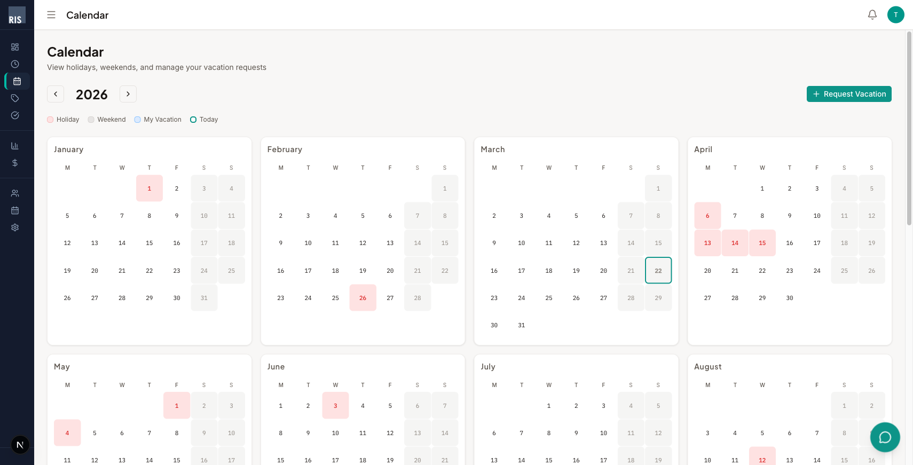

### 4.1 อ่านปฏิทิน

| สี/เครื่องหมาย | ความหมาย |
|---------------|----------|
| วงกลม **สีชมพู/แดง** | วันหยุดราชการ (เช่น วันสงกรานต์) |
| พื้นหลัง **สีเทา** | วันเสาร์-อาทิตย์ |
| วงกลม **สีฟ้า** | วันลาของคุณ |
| วงกลม **สีเขียว** | วันนี้ |

- กดปุ่ม **< >** ข้าง "2026" เพื่อเปลี่ยนปี

### 4.2 ขอลาพักร้อน

1. กดปุ่ม **"+ Request Vacation"** สีเขียว (มุมขวาบนของปฏิทิน)
2. เลือก **วันเริ่ม** และ **วันสิ้นสุด**
3. เลือกประเภท: **ลาเต็มวัน** / **ลาครึ่งวันเช้า** / **ลาครึ่งวันบ่าย**
4. กดส่ง → คำขอจะถูกส่งไปให้หัวหน้าอนุมัติ

### 4.3 ประวัติวันลา

ด้านล่างปฏิทิน (ส่วน **"My Vacation Requests"**) แสดงรายการวันลาทั้งหมดของคุณ พร้อมสถานะ

---

## 5. อนุมัติใบบันทึกเวลา

> 👔 **สำหรับหัวหน้างานและผู้ดูแลระบบ** (charge_manager, admin)

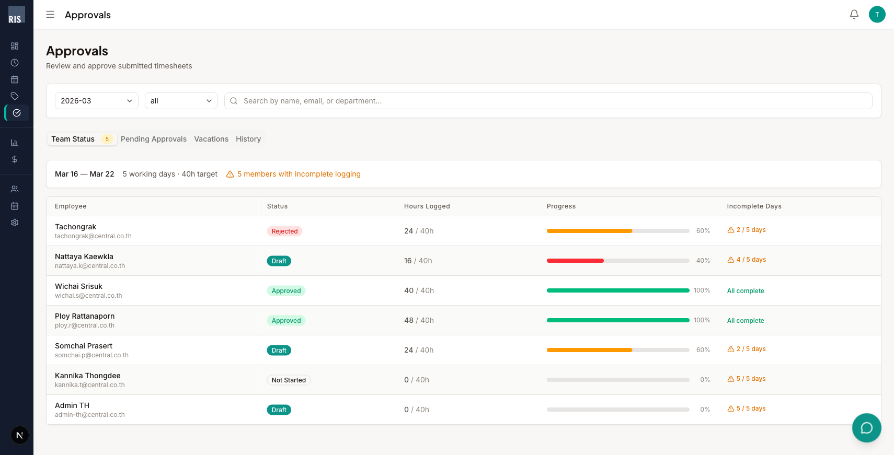

### 5.1 แท็บต่าง ๆ (กดที่ชื่อแท็บด้านบนเพื่อสลับ)

| แท็บ | คำอธิบาย |
|------|----------|
| **Team Status** (ค่าเริ่มต้น) | ดูว่าลูกทีมแต่ละคนบันทึกเวลาครบหรือไม่ แสดงแถบสี: เขียว=ครบ, เหลือง=เกินครึ่ง, แดง=น้อย |
| **Pending Approvals** | รายการใบบันทึกเวลาที่รอคุณอนุมัติ |
| **Vacations** | คำขอลาที่รอคุณอนุมัติ |
| **History** | ประวัติที่คุณอนุมัติ/ตีกลับไปแล้ว |

### 5.2 อนุมัติใบบันทึกเวลา (ทีละใบ)

1. กดแท็บ **"Pending Approvals"**
2. กรองด้วย:
   - **ช่องเดือน** (ซ้ายบน เช่น "2026-03") — เลือกเดือน
   - **ช่อง status** — เลือก all / pending
   - **ช่องค้นหา** — พิมพ์ชื่อ อีเมล หรือแผนก
3. กด **ไอคอนตา** ด้านขวาของแต่ละแถว เพื่อดูรายละเอียด
4. กดปุ่ม **✓ (อนุมัติ)** หรือ **✗ (ตีกลับ)**
   - ถ้าตีกลับ สามารถเขียนเหตุผลให้พนักงานรู้ได้

### 5.3 อนุมัติทีเดียวหลายใบ

1. **ติ๊กช่องเลือก** หน้าแต่ละแถวที่ต้องการ
2. จะมี **แถบอนุมัติรวม** ขึ้นมาด้านล่าง
3. กดปุ่มอนุมัติรวม เพื่ออนุมัติทั้งหมดที่เลือก

### 5.4 อนุมัติวันลา

1. กดแท็บ **"Vacations"**
2. ดูชื่อพนักงาน วันที่ลา ประเภทการลา
3. กดปุ่ม **"Approve"** หรือ **"Reject"** ที่แต่ละรายการ

---

## 6. จัดการรหัสงาน

> 👔 **สำหรับผู้ดูแล** (admin, charge_manager, PMO, finance)

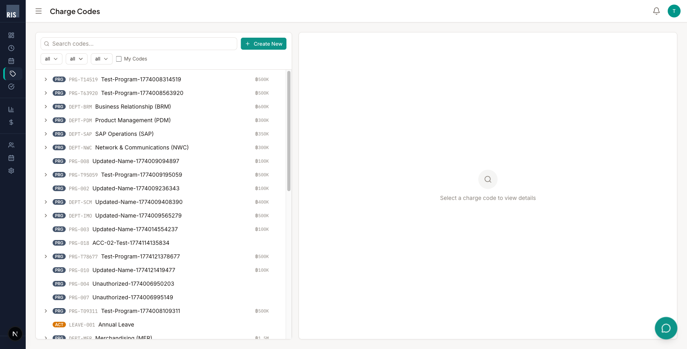

### 6.1 โครงสร้างรหัสงาน

| ระดับ | ตัวอย่าง | ไอคอน |
|-------|----------|-------|
| **โปรแกรม** (Program) | "Order Management System" — งานใหญ่สุด | PRG (สีเขียว) |
| **โปรเจกต์** (Project) | "Phase 2 - Mobile App" | PRJ |
| **กิจกรรม** (Activity) | "Development" | ACT (สีส้ม) |
| **งานย่อย** (Task) | "Login Page" | TSK |

### 6.2 ค้นหาและกรอง

| กดตรงไหน | ทำอะไร |
|---------|--------|
| ช่อง **"Search codes..."** (ด้านบนซ้าย) | พิมพ์ชื่อหรือรหัสเพื่อค้นหา |
| **ช่อง dropdown** 3 ช่อง (all / all / all) | กรองตามระดับ, สถานะ, ประเภท |
| ช่องติ๊ก **"My Codes"** | แสดงเฉพาะรหัสงานที่มอบหมายให้คุณ |
| ปุ่ม **"+ Create New"** สีเขียว | สร้างรหัสงานใหม่ (เฉพาะผู้ดูแล) |
| กดที่ **ชื่อรหัสงาน** ในรายการ | ดูรายละเอียดในแผงด้านขวา |
| กดปุ่ม **ลูกศร >** หน้ารหัสงาน | ขยายดูโปรเจกต์/กิจกรรมย่อย |

### 6.3 สร้างรหัสงานใหม่ (เฉพาะผู้ดูแล)

1. กดปุ่ม **"+ Create New"** สีเขียว (มุมขวาบน)
2. กรอก: ชื่อ, ระดับ, รหัสงานแม่, งบประมาณ, ประเภท (billable/non-billable), วันเริ่ม-สิ้นสุด
3. กดบันทึก

---

## 7. รายงาน

> 📊 **สำหรับผู้บริหาร ฝ่ายวางแผน และการเงิน** (admin, PMO, finance)

### 7.1 ภาพรวม (แท็บ Overview)

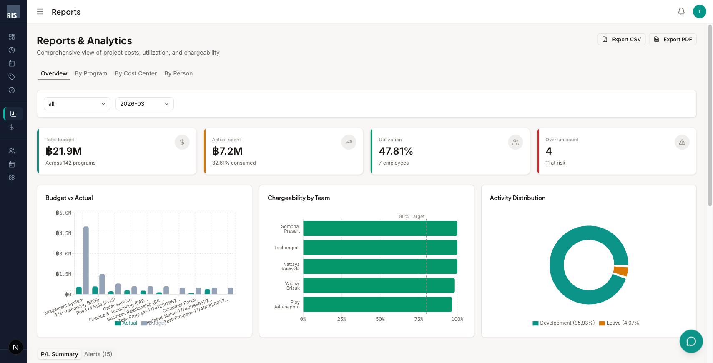

**ส่วนประกอบบนหน้าจอ:**

| ตำแหน่ง | สิ่งที่แสดง |
|---------|-----------|
| **มุมขวาบน** | ปุ่ม **"Export CSV"** (ดาวน์โหลดข้อมูลเป็นตาราง) และ **"Export PDF"** (สร้างรายงานพิมพ์ได้) |
| **แถบแท็บ** | กด **Overview** / **By Program** / **By Cost Center** / **By Person** เพื่อสลับมุมมอง |
| **ช่อง dropdown** | เลือกหน่วยงาน + เดือนที่ต้องการดู |
| **4 กล่องสรุป** | งบรวม (฿21.9M), ค่าใช้จ่ายจริง (฿7.2M), อัตราใช้กำลังคน (47.81%), จำนวนเกินงบ (4) |
| **กราฟ Budget vs Actual** | เปรียบเทียบงบกับค่าใช้จ่ายจริงเป็นแท่ง แยกตามโปรแกรม |
| **กราฟ Chargeability by Team** | แท่งแนวนอนแสดงแต่ละคน เส้นประ = เป้า 80% |
| **กราฟ Activity Distribution** | วงกลมแสดงสัดส่วนประเภทงาน (Development vs Leave) |
| **ตาราง P/L Summary** | กำไร-ขาดทุนแยกตามโปรแกรม (กดแท็บ **"Alerts"** เพื่อดูรายการเตือน) |

### 7.2 แยกตามโปรแกรม (แท็บ By Program)

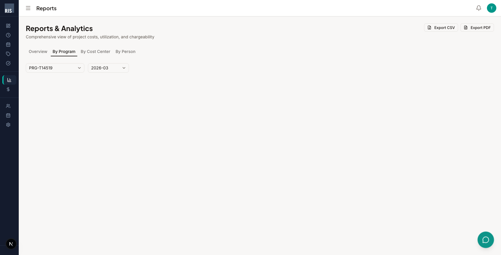

1. กดแท็บ **"By Program"** ที่แถบด้านบน
2. เลือก **โปรแกรม** จาก dropdown ซ้าย (เช่น "PRG-T14519")
3. เลือก **เดือน** จาก dropdown ขวา
4. ระบบจะแสดงรายละเอียดชั่วโมง ค่าใช้จ่าย และงบแยกตามโปรเจกต์/กิจกรรมภายในโปรแกรมนั้น

### 7.3 แยกตามหน่วยงาน (แท็บ By Cost Center)

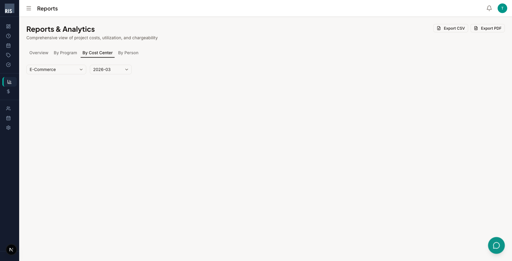

1. กดแท็บ **"By Cost Center"**
2. เลือก **หน่วยงาน** จาก dropdown (เช่น "E-Commerce")
3. เลือก **เดือน**
4. ดูค่าใช้จ่ายแยกตามแผนก — เหมาะสำหรับฝ่ายการเงิน

### 7.4 แยกตามบุคคล (แท็บ By Person)

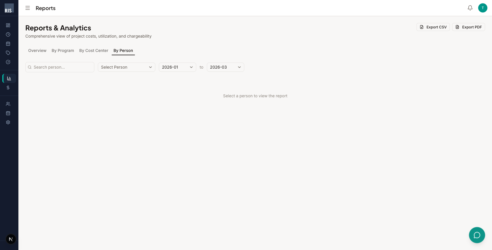

1. กดแท็บ **"By Person"**
2. พิมพ์ชื่อในช่อง **"Search person..."** หรือเลือกจาก dropdown **"Select Person"**
3. เลือก **ช่วงเดือน** (เช่น 2026-01 ถึง 2026-03)
4. ดูชั่วโมง อัตรา charge งาน และรหัสงานที่ใช้ของบุคคลนั้น

---

## 8. งบประมาณ

> 📊 **สำหรับผู้บริหาร ฝ่ายวางแผน และการเงิน** (admin, PMO, finance)

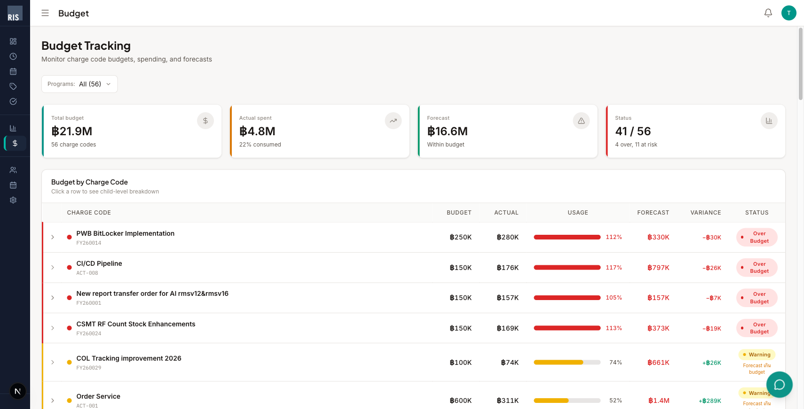

### 8.1 อ่านหน้างบประมาณ

| ตำแหน่ง | สิ่งที่แสดง |
|---------|-----------|
| **dropdown "Programs"** (ด้านบน) | กรองตามโปรแกรม หรือดูทั้งหมด ("All") |
| **4 กล่องสรุป** | งบรวม (฿21.9M), ค่าใช้จ่ายจริง (฿4.8M), คาดการณ์ (฿16.6M), สถานะ (41/56 ปกติ, 4 เกินงบ) |
| **ตาราง "Budget by Charge Code"** | รายละเอียดแต่ละรหัสงาน |

### 8.2 อ่านตารางงบ

แต่ละแถวในตารางแสดง:

| คอลัมน์ | ความหมาย |
|---------|----------|
| **Charge Code** | ชื่อและรหัสงาน |
| **Budget** | งบที่ตั้งไว้ |
| **Actual** | ค่าใช้จ่ายจริง |
| **Usage** | แถบสี + เปอร์เซ็นต์การใช้งบ |
| **Forecast** | ค่าใช้จ่ายที่คาดการณ์ |
| **Variance** | ส่วนต่าง (+ = เหลืองบ, - = เกินงบ) |
| **Status** | ป้ายสีแสดงสถานะ |

**ความหมายของสี Status:**

| สี | ป้าย | ความหมาย |
|----|------|----------|
| 🟢 เขียว | On Track | ปกติ ยังอยู่ในงบ |
| 🟡 เหลือง | Warning | ใช้เกิน 75% — ควรระวัง |
| 🟠 ส้ม | Forecast เกิน | คาดว่าจะเกินงบ |
| 🔴 แดง | Over Budget | เกินงบแล้ว |

**กดลูกศร > หน้าแต่ละแถว** เพื่อขยายดูโปรเจกต์/กิจกรรมย่อยภายในรหัสงานนั้น

---

## 9. การแจ้งเตือน

> 👤 ทุกคนได้รับการแจ้งเตือน (ประเภทต่างกันตามตำแหน่ง)

### 9.1 ดูการแจ้งเตือน

กดที่ **ไอคอนกระดิ่ง** (มุมขวาบน ข้างรูปโปรไฟล์) → จะเห็นจำนวนที่ยังไม่ได้อ่าน

### 9.2 ประเภทการแจ้งเตือน

| ประเภท | ใครได้รับ | รายละเอียด |
|--------|----------|-----------|
| **เตือนส่งใบบันทึกเวลา** | 👤 พนักงาน | แจ้งเตือนก่อนถึงกำหนดส่ง |
| **แจ้งใบรออนุมัติ** | 👔 หัวหน้า | มีลูกทีมส่งใบบันทึกเวลามาให้อนุมัติ |
| **สรุปสถานะทีมรายสัปดาห์** | 👔 หัวหน้า | สรุปว่าใครส่งแล้ว ใครยังไม่ส่ง |
| **วิเคราะห์รายสัปดาห์** | 👤 ทุกคน | ข้อมูลเชิงลึกเกี่ยวกับแนวโน้มการ charge งาน |
| **เตือนงบประมาณ** | 📊 ผู้ดูแล/การเงิน | รหัสงานที่ใกล้เกินหรือเกินงบแล้ว |

---

## 10. ตั้งค่าโปรไฟล์

> 👤 ทุกคนสามารถตั้งค่าได้

### 10.1 โปรไฟล์

กดที่ **รูปโปรไฟล์มุมขวาบน** → เลือก **"Profile"**

- แก้ไข **ชื่อที่แสดง** และ **แผนก** ได้ → กด **"Save"**
- อีเมล ตำแหน่ง และระดับงาน ดูได้แต่แก้ไขเองไม่ได้ (ต้องให้ผู้ดูแลเปลี่ยน)
- กดปุ่ม **"Change Password"** เพื่อเปลี่ยนรหัสผ่าน

### 10.2 การตั้งค่า

กดที่ **รูปโปรไฟล์มุมขวาบน** → เลือก **"Settings"**

| การตั้งค่า | วิธีเปลี่ยน |
|-----------|------------|
| **ธีมหน้าจอ** | กดเลือก Light (สว่าง) หรือ Dark (มืด) |
| **มุมมองเริ่มต้น** | เลือก Weekly (รายสัปดาห์) หรือ Bi-weekly (ราย 2 สัปดาห์) |
| **เขตเวลา** | เลือกจาก dropdown (เช่น Asia/Bangkok) |
| **สกุลเงิน** | เลือก THB (฿), USD ($), EUR (€), JPY (¥) |
| **การแจ้งเตือน** | ติ๊กเปิด/ปิดแยกตามประเภท: อีเมล, ในระบบ, Teams |

---

## 11. สิทธิ์การใช้งานตามตำแหน่ง

ระบบแบ่งสิทธิ์ตามตำแหน่ง — ไม่ใช่ทุกคนจะเห็นทุกเมนู:

| ตำแหน่ง | หน้าหลัก | บันทึกเวลา | ปฏิทิน | รหัสงาน | อนุมัติ | รายงาน | งบประมาณ | จัดการระบบ |
|---------|---------|-----------|--------|---------|---------|--------|---------|-----------|
| 👤 **พนักงาน** | ✅ | ✅ | ✅ | ❌ | ❌ | ❌ | ❌ | ❌ |
| 👔 **หัวหน้างาน** | ✅ | ✅ | ✅ | ✅ | ✅ | ❌ | ❌ | ❌ |
| 📊 **ฝ่ายวางแผน** | ✅ | ✅ | ✅ | ✅ | ❌ | ✅ | ✅ | ❌ |
| 📊 **ฝ่ายการเงิน** | ✅ | ✅ | ✅ | ✅ | ❌ | ✅ | ✅ | ❌ |
| ⚙️ **ผู้ดูแลระบบ** | ✅ | ✅ | ✅ | ✅ | ✅ | ✅ | ✅ | ✅ |

---

## 12. สรุปขั้นตอนการใช้งาน

### 👤 พนักงาน — ทำทุกสัปดาห์

| วัน | ทำอะไร | กดตรงไหน |
|-----|--------|---------|
| **จ.** | เพิ่มรหัสงาน | กด **"+ Add Charge Code"** ด้านล่างตาราง (หรือ "Copy from Last Period") |
| **จ.–ศ.** | กรอกชั่วโมงทุกวัน | กดช่องในตาราง → พิมพ์ชั่วโมง |
| **ศ.** | ตรวจยอดรวม | ดูแถว Daily Total — ทุกวันต้อง 8.00 |
| **ศ.** | ส่งใบ | กดปุ่ม **"Submit →"** สีเขียว มุมขวาล่าง |
| | รอผล | หัวหน้าอนุมัติ → ได้แจ้งเตือน |

### 👔 หัวหน้างาน — ทำทุกสัปดาห์

| ขั้นตอน | ทำอะไร | กดตรงไหน |
|---------|--------|---------|
| 1 | ดูสถานะทีม | ไปหน้า **Approvals** → แท็บ **"Team Status"** |
| 2 | ตรวจใบที่ส่งมา | กดแท็บ **"Pending Approvals"** |
| 3 | ดูรายละเอียด | กด **ไอคอนตา** ที่แต่ละแถว |
| 4 | อนุมัติ/ตีกลับ | กดปุ่ม **✓** หรือ **✗** |
| 5 | ตรวจวันลา | กดแท็บ **"Vacations"** → กด Approve/Reject |

### 📊 ผู้บริหาร / การเงิน — ทำทุกเดือน

| ขั้นตอน | ทำอะไร | กดตรงไหน |
|---------|--------|---------|
| 1 | ดูภาพรวมตัวเลข | ไปหน้า **Reports** → แท็บ **"Overview"** |
| 2 | ดูแยกตามโปรแกรม | กดแท็บ **"By Program"** → เลือกโปรแกรม |
| 3 | ดูงบประมาณ | ไปหน้า **Budget** → ดูตาราง + สถานะสี |
| 4 | ส่งออกข้อมูล | กดปุ่ม **"Export CSV"** หรือ **"Export PDF"** มุมขวาบน |

---

> 📞 **ต้องการความช่วยเหลือ?** กดปุ่มแชท (วงกลมสีเขียวมุมขวาล่าง) เพื่อคุยกับ JARVIS ผู้ช่วย AI หรือติดต่อฝ่าย IT
